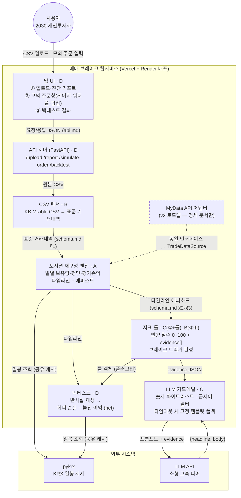

# 매매 브레이크 — 시스템 아키텍처 (C4 컨테이너 수준)

> 목적: 전체 구조와 모듈 경계를 한 장으로 공유. **각 박스 = 한 사람의 소유 모듈**, **각 화살표 = 합의해야 할 인터페이스**(스키마 문서 항목과 1:1 대응).
> 위치: 레포 `docs/architecture.md` · 변경 시 이 파일부터 PR

## 컨테이너별 책임·입출력

| 컨테이너 | 담당 | 책임 (한 줄) | 입력 | 출력 |
|---|---|---|---|---|
| 웹 UI | D | 화면 3개 렌더 (게이지·워터폴 포함) | API JSON | 사용자 화면 |
| API 서버 | D | 파이프라인 오케스트레이션, 엔드포인트 4개 | UI 요청 | 각 모듈 호출·응답 조립 |
| CSV 파서 | B | KB CSV → 표준 거래내역 + 검증 리포트 | 원본 CSV | 표준 거래내역 |
| 재구성 엔진 | A | 거래 재생 → 일별 타임라인·에피소드 | 표준 거래내역, 일봉 | 타임라인, 에피소드 |
| 지표·룰 | C·B | 편향 점수 3종 + evidence, 트리거 판정 | 타임라인, 에피소드 | 점수·evidence, 룰 객체 |
| 백테스트 | D | 반사실 재생 → net 리포트 | 타임라인, 룰 객체, 일봉 | net 수치 헤드라인 |
| LLM 가드레일 | C | evidence → 코칭 문구 (검증·폴백 포함) | evidence JSON | {headline, body} |

## 설계 포인트 (그림에서 읽을 것)

- **판단 경로에 LLM 없음**: 사용자 → 파서 → 엔진 → 지표·룰 → 백테스트 라인은 전부 결정론적. LLM은 곁가지(설명 레이어)로만 붙는다 → 화이트박스 주장의 구조적 근거
- **점선 박스(MyData 어댑터)**: 규제 준수형 설계의 시각화. 사업화 시 데이터 소스만 교체되고 엔진 이후는 그대로 — 기획서 아키텍처 그림에 이 상태 그대로 재사용
- **pykrx 캐시 공유**: 엔진(A)과 백테스트(D)가 같은 캐시 모듈 사용 — 중복 구현 금지

## 킥오프에서 이 그림으로 확인할 것

- [ ] 각자 자기 박스에 들어오는/나가는 화살표(=내 입출력 인터페이스)를 소리 내어 확인
- [ ] 화살표마다 대응하는 명세 문서 항목(schema.md / api.md / rules.md)이 존재하는지 대조
- [ ] A~D를 실명으로 교체
