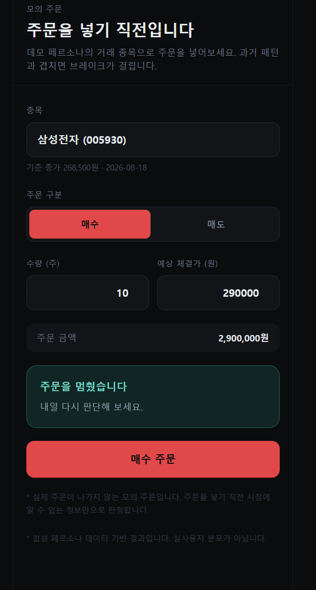
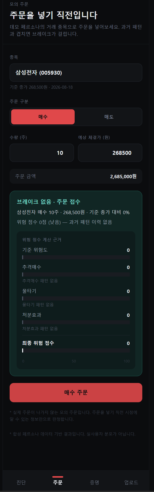
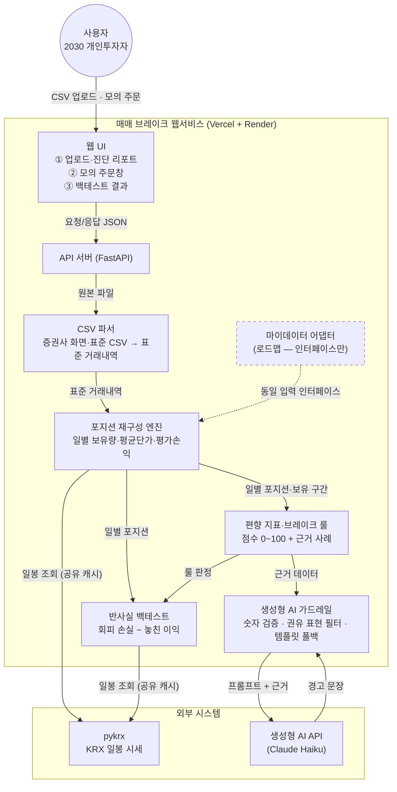
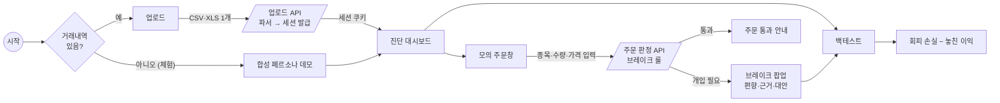
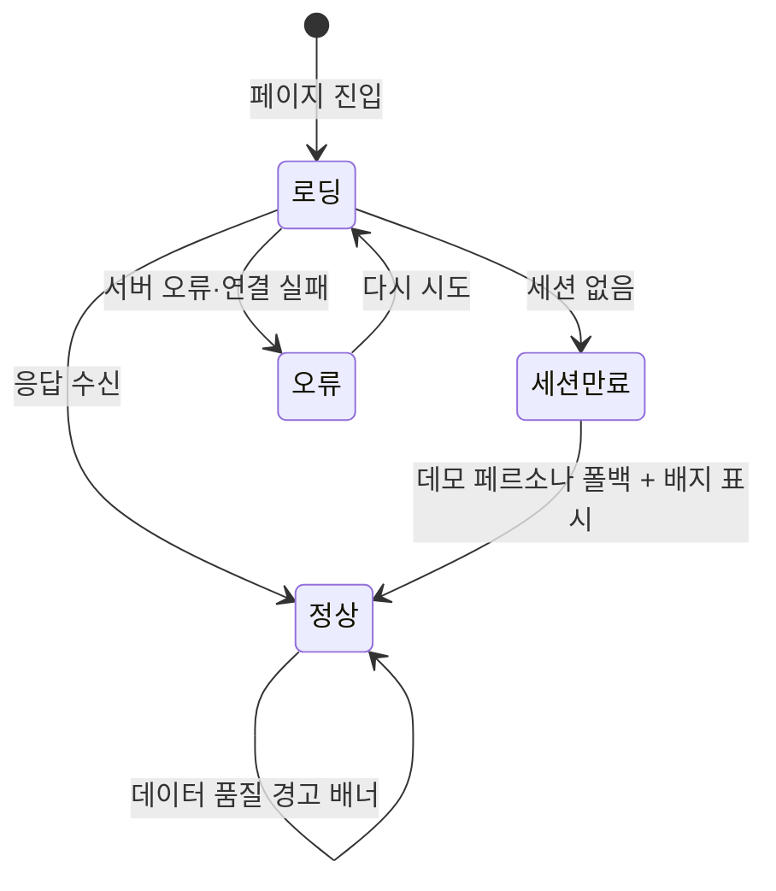
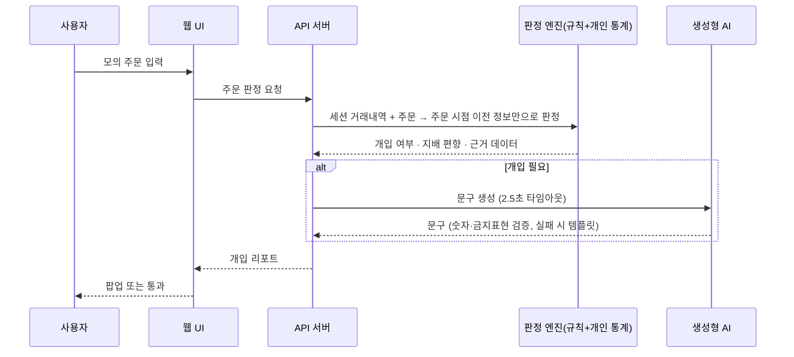

# 매매 브레이크 — MVP 산출물

> 2026 금융 AI Challenge 출품작 · 제출: 2026-09-07 10:00

- 서비스 URL: https://brakefit.vercel.app
- API 문서: https://brakefit.onrender.com/docs
- 소스 코드: https://github.com/durinnn/brakefit
- 팀: 지종우(리더, 데이터 계약·포지션 엔진·웹·배포) · 최성범(파서·합성 데이터) · 강준일(편향 지표·브레이크 룰·가드레일) · 임승규(백테스트·API)
- 함께 제출: 서비스 기획서(문제 정의·컨셉·AI 아키텍처 논증·활용 방안·로드맵)

---

## 시연 가이드

**데모 주소.** 화면은 https://brakefit.vercel.app 에서 바로 열 수 있고, API 스키마와 예시 응답은 https://brakefit.onrender.com/docs 에서 확인할 수 있다.

**접속 시 주의.** API 서버가 무료 플랜에 올라가 있어 절전 상태였다면 첫 요청에서 서버 기동에 수 초가 걸릴 수 있다. 첫 화면이 골격만 보이더라도 잠시 기다리면 데이터가 채워진다. 두 번째 요청부터는 지연이 없다.

**90초 시연 순서**

1. 첫 화면에서 데모 페르소나로 바로 진입하거나, 거래내역 파일을 업로드한다. (업로드 화면)
2. 진단 대시보드에서 종합 점수와 등급, 편향 3종의 점수·백분위·근거를 확인한다. (진단 대시보드)
3. 모의 주문창으로 이동해 종목·수량·가격을 넣고 매수 주문을 넣는다. (모의 주문창)
4. 브레이크 팝업이 뜬다. 기준 종가 대비 등락률, 위험 게이지, 기여도 분해, 본인 이력 기반 경고문, 대안 제안을 확인한다. (모의 주문창 — 브레이크 팝업)
5. "멈추기"를 누른 뒤 백테스트 화면으로 이동한다. (모의 주문창 → 백테스트 결과)
6. 회피한 손실과 놓친 이익, 그 차이인 순효과와 손실 회피율을 확인한다. (백테스트 결과)

| 진단 | 모의 주문 | 브레이크 팝업 | 백테스트 |
|---|---|---|---|
|  |  |  |  |

**데모 데이터.** 업로드 없이 접속하면 화면은 합성 페르소나 중 추격매수형(chasing_prone)으로 고정되어 그려진다. 거래내역을 업로드하면 그 뒤로는 전 화면이 업로드한 데이터 기준으로 바뀌며, 진단 대시보드 상단의 "데모로 되돌리기"로 다시 데모 데이터로 돌아온다(모의 주문창의 판정 결과도 이 출처를 따르므로, 업로드 데이터에 추격매수 이력이 없으면 같은 주문에 위험 점수 0의 옅은 확인 팝업이 뜬다). 나머지 페르소나 네 종(rational_baseline 차분형 대조군 · disposition_prone 처분효과형 · averaging_down_prone 물타기형 · mixed_realistic 복합형)의 결과는 API 문서에서 `persona` 파라미터로 직접 조회할 수 있다.

**샘플 업로드 파일.** 업로드 흐름을 직접 확인하려면 소스 저장소의 `fixtures/upload/` 에 있는 표준 CSV를 올리면 된다. 데이터 품질 경고와 제외 행 표시까지 함께 볼 수 있는 표본도 같은 폴더에 들어 있다.

---

## 1. 개요와 구현 범위

거래내역으로 개인의 행동 편향을 수치화하고, 같은 실수가 반복되기 직전에 개입하며, 그 개입의 효과를 본인의 데이터로 계산해 보여주는 소비자보호형 웹서비스다.

**핵심 가치**

| | 가치 | 내용 |
|---|---|---|
| ① | 개인 실증 기반 개입 | 경고의 강도가 전역 가중치가 아니라 사용자 본인의 과거 거래 통계에서 나온다. "왜 나에게 이 경고가 이만큼 세게 뜨는가"에 데이터로 답한다. |
| ② | 역할이 분리된 하이브리드 AI | 금전적 판단은 결정론적 규칙과 개인 통계가, 사용자와의 소통은 생성형 AI가 맡는다. 판정은 재현 가능하고, 설명은 개인의 실제 거래를 인용해 생성되며, 생성문은 숫자 검증과 권유 표현 필터를 통과해야만 화면에 나간다. 금융당국이 요구하는 설명가능성·책임성을 아키텍처로 구현한 분업이다. |
| ③ | 정직한 검증 | 개입의 효과를 반사실로 계산하는 기능을 서비스 안에 내장했다. 검증 구간에서 개입이 순손실로 나온 결과를 감추지 않고 그대로 화면에 띄운다. |

업로드부터 백테스트까지 이어지는 파이프라인 전체를 구현해 배포했다. 화면은 업로드·진단 대시보드·모의 주문창·백테스트 결과 네 개이고, 이를 받치는 API는 여섯 개다. 실사용자 거래내역이 없어도 전 화면을 볼 수 있도록 합성 페르소나 5종을 동봉했고, 시세도 파일 캐시로 함께 넣어 외부 네트워크 없이 데모가 동작한다. 포지션 엔진·편향 지표·브레이크 룰·반사실 백테스트·생성형 AI 가드레일은 모두 자동 테스트 222개로 고정되어 있으며, 프론트엔드와 API 서버는 각각 상시 접근 가능한 URL에 배포되어 있다.

| | 기능 | 화면 | 상태 | 기획서 대응 |
|---|---|---|---|---|
| F1 | 거래내역 업로드 — 표준 CSV와 증권사 화면 3종 자동 인식 | 업로드 | 완료 | 기획서 3장 진단 |
| F2 | 편향 진단 리포트 — 종합 점수·등급, 지표 3종 점수·백분위·근거 | 진단 대시보드 | 완료 | 기획서 3장 진단 · 4장 제2계층 |
| F3 | 모의 주문 개입 — 브레이크 룰 판정, 위험 게이지, 기여도 분해, 생성형 경고문 | 모의 주문창 | 완료 | 기획서 3장 개입 · 4장 3계층 |
| F4 | 반사실 백테스트 — 회피한 손실, 놓친 이익, 순효과, 손실 회피율 | 백테스트 결과 | 완료 | 기획서 6장 검증 철학 |
| F5 | 합성 페르소나 데모 모드 — 업로드 없이 전 화면 체험 | 전 화면 | 완료 | 기획서 5장 시나리오 |
| F6 | 데이터 품질 경고 — 보유수량 초과 매도, 종목코드 미해결 등 | 진단 대시보드 배너 | 완료 | 기획서 4장 제1계층 |

**전 화면 공통 동작.** 서버 응답 대기 중에는 빈 화면 대신 카드 골격을 먼저 그린다. 서버 연결 실패 시 한국어 안내와 "다시 시도"·"홈으로" 버튼을 보여준다. 업로드 세션이 만료되면 데모 페르소나로 자동 전환하고 배지에 만료 사실을 표시한다(세션 정책은 5.4절). 데모 페르소나를 보는 동안에는 모든 화면 하단에 "합성 데이터이며 실사용자 분포가 아님" 각주가 붙는다.

이 문서의 화면 이미지는 2026-09-07 프로덕션 화면, 데모 페르소나(추격매수형) 기준이다.

---

## 2. 화면·기능 명세

### 2.1 거래내역 업로드

사용자가 증권사에서 내려받은 거래내역 파일을 올려, 데모 페르소나 대신 자신의 데이터로 진단을 받는 화면이다. 업로드가 끝나면 무엇이 몇 건 읽혔고 무엇이 빠졌는지를 먼저 보여준다.


**표시 정보** — 파일 선택 영역(선택 시 파일명·용량 표시), 안내문(국내 주식 체결 내역만 분석, 종목코드가 없으면 종목명으로 조회, 업로드 없이도 데모로 전 화면 열람 가능), 업로드 결과 카드(읽어들인 거래 건수와 기간, 인식된 형식, 제외된 행 수), 확인이 필요한 항목 목록(데이터 품질 경고가 있을 때만).

**사용자 행동** — 파일을 선택하고 "업로드하고 진단하기"를 누른다(선택 전에는 버튼 비활성). "진단 보기"로 대시보드로 이동하거나 "다른 파일 올리기"로 재시도한다.

**예외 처리** — 처리 중에는 버튼이 "분석 중…"으로 잠긴다. 형식 불일치나 용량 초과는 실패 사유를 한국어 문장으로 안내한다.


### 2.2 진단 대시보드

사용자의 매매 습관을 한 화면에 요약하는 진단 리포트다. 종합 점수로 전체 강도를, 지표 3종으로 어떤 편향이 두드러지는지를 보여준다.


**표시 정보** — 데이터 출처 배지("데모 페르소나" 또는 "내 거래내역 · N건", 전환 링크 포함), 데이터 품질 경고 배너(해당 시), 종합 편향 게이지(0~100)와 등급(안정·주의·위험), 지표 3종 카드(점수, 진행바, "합성 기준선 상위 N%" 표기, 근거 사례 건수와 한 줄 요약), 백테스트 화면 안내.

**사용자 행동** — 배지 링크로 데모와 내 거래내역을 오간다. 안내 문구로 백테스트 화면으로, 하단 탭으로 다른 화면으로 이동한다.

**예외 처리** — 분석 가능한 거래가 한 건도 없으면 점수 대신 "분석 불가" 카드와 사유 배너를 보여준다.


### 2.3 모의 주문창

실제 주문 화면을 본뜬 모의 주문창이다. 사용자가 주문을 넣으면 그 주문이 본인의 과거 편향 패턴과 겹치는지 판정하고, 겹치면 화면을 멈춘다.


**표시 정보 — 주문 입력.** 종목 선택 목록(거래내역에 있는 종목, 선택 시 기준 종가가 예상 체결가 기본값으로 입력), 매수·매도 선택, 수량, 가격, 총액, 주문 실행 버튼.

**표시 정보 — 브레이크 팝업.**

- 주문 요약: 종목명과 코드, 기준 종가 대비 등락률, 수량·단가·총액. 화면의 기준 종가는 판정에 쓴 값과 같은 값이다.
- 위험 게이지(0~100)와 등급(낮음·주의·매우 위험). 개입이 발생한 상태에서는 표시 등급을 최소 "주의"로 올린다. 경고 팝업과 게이지가 반대되는 인상을 주지 않기 위한 표시 보정이며, 점수와 판정 자체는 규칙이 낸 값 그대로다.
- 기여도 분해: 기준 위험도에서 시작해 추격매수·물타기·처분효과가 각각 얼마를 더했는지와 최종 위험 점수, 항목별 근거 문구.
- 과거 패턴 경고: 생성형 AI가 본인 이력을 인용해 작성한 헤드라인과 설명 문장, 유사 사례 건수, 지배 편향에 따른 평균값(추격매수는 매수 시점 평균 급등률, 물타기는 매수 시점 평균 평가손익률, 처분효과는 사례 평균 손익률).
- 대안 제안 목록과 "멈추기" · "경고를 무시하고 주문 진행" 버튼.

예를 들어 기준 종가가 268,500원(2026-08-18)인 종목에 290,000원으로 10주 매수 주문을 넣으면, 기준 종가 대비 8.01% 높은 가격이므로 추격매수 규칙이 발동하고 팝업이 뜬다.


**사용자 행동** — 주문을 입력하고 주문 버튼을 누른다. 개입 시 "멈추기"로 중단하거나, "경고를 무시하고 주문 진행"으로 2단계 확인을 거쳐 진행한다. 개입이 아니면 팝업 없이 통과 안내를 보여준다.





**예외 처리** — 판정 대기 중에는 버튼이 "판정 중…"으로 바뀐다. 기준 종가를 구하지 못하는 종목은 예상 체결가 직접 입력을 안내한다. 멈추기/진행 선택은 화면 안의 기록이며 서버에 남지 않고, 화면 문구도 그 범위로만 안내한다.

### 2.4 백테스트 결과

브레이크를 따랐다면 손익이 어떻게 달라졌을지를 금액으로 보여주는 화면이다. 개입의 효과를 주장이 아니라 계산 결과로 제시한다.


**표시 정보** — 분석 기간과 개입 대상 건수, 순효과 카드(금액·비율, 양음 색 구분), 개입 건수와 손실 회피율, 회피한 손실·놓친 이익 막대와 "회피한 손실 − 놓친 이익 = 순효과" 계산식, 주요 개입 사례 목록(날짜, 종목명, 편향 종류, 금액 영향).

**사용자 행동** — 읽기 전용 화면으로, 스크롤로 사례 목록을 확인한다.

**예외 처리** — 개입 대상 거래가 없으면 "증명할 개입 사례가 없습니다"를 안내한다.

화면 전환, 상태 처리, 요청 단위 데이터 흐름은 부록 D의 흐름도에 정리했다.

---

## 3. 핵심 알고리즘

### 3.1 포지션 재구성 엔진

거래내역만으로는 "그 매수를 넣던 날 그 종목이 얼마나 평가손실이었는지"를 알 수 없다. 그래서 모든 분석에 앞서 거래내역과 일봉 시세를 합쳐 일별 포지션 이력을 다시 만든다. 출력은 (일자, 종목) 단위이며 보유수량, 평균단가, 종가, 평가손익과 평가손익률, 그날의 실현손익, 보유 경과일을 담는다.

- **보유 구간 분리.** 보유수량이 0에서 양수가 되는 시점을 진입, 다시 0이 되는 시점을 청산으로 보고 그 사이를 하나의 보유 구간으로 묶는다. 전량 청산 후 재진입하면 별개의 구간이다. 지표는 이 구간 단위로 "진입 매수"와 "추가매수"를 구분한다.
- **평균단가는 매수금액 기준.** 매입 가중 이동평균으로 계산하고, 매도 시점에는 평균단가를 바꾸지 않는다.
- **종가가 없는 날.** 거래정지 등으로 종가가 비면 직전 종가를 이어 쓰고 그 사실을 경고로 남긴다.
- **수수료·세금의 미제공과 0원을 구분한다.** 증권사 화면에 따라 수수료 항목이 아예 없는 경우가 있는데, 이때 값을 0으로 채우면 실현손익이 조용히 과대 계산된다. 값이 없는 것과 실제로 0원인 것을 끝까지 다른 값으로 다루고, 값이 없으면 그 거래의 손익이 수수료 차감 전 금액임을 표시한다.

### 3.2 편향 지표 3종

세 지표 모두 0~100점으로 정규화하며, 점수와 함께 그 점수의 근거가 된 실제 거래 목록을 반환한다. 화면에 뜨는 모든 문장은 이 근거 목록의 숫자에서 나온다.

**처분효과**

- 정의: 오른 종목은 서둘러 팔고 내린 종목은 계속 버티는 경향.
- 측정: 청산된 보유 구간은 실현손익의 부호로, 아직 보유 중인 구간은 최신 평가손익의 부호로 이익 건과 손실 건을 나눈다. 별도 문턱을 두지 않고 부호만 본다. 문턱을 두면 문턱 부근 구간의 손익 부호가 사실상 무작위에 가까워져 신호가 희석되기 때문이다.
- 산식: PGR = 실현이익 건수 / (실현이익 건수 + 미실현이익 건수), PLR = 실현손실 건수 / (실현손실 건수 + 미실현손실 건수), 점수 = (PGR − PLR + 1) / 2 × 100. 50이 중립(이익·손실 실현 성향이 같음), 100에 가까울수록 이익만 서둘러 실현하는 성향이다.
- 근거 사례: 가장 빨리 판 이익 실현 건 하나와 가장 오래 버틴 손실 건 하나. 예: "1일 만에 매도, 실현손익 190,081원(11.27%)".

**물타기**

- 정의: 이미 평가손실 상태인 종목에 추가매수하는 경향. 진입 매수 자체는 물타기가 아니므로 진입 이후의 추가매수만 센다.
- 측정: 각 매수 거래를 해당 종목의 보유 구간에 되맞춘 뒤, 진입일 매수를 제외하고, 매수 당일 평가손익이 음수였던 건만 센다.
- 산식: 점수 = 평가손실 상태 추가매수 건수 / 전체 매수 건수 × 100.
- 근거 사례: 예: "평가손실 −62,234원(−4.0%) 상태에서 2주 추가매수".

**추격매수**

- 정의: 이미 오른 종목을 더 오를 것으로 기대하고 뒤늦게 따라 사는 경향.
- 측정: 보유 중인 종목에 대한 추가매수 가운데, 전일 종가 대비 5% 이상 급등한 가격에 체결된 건을 센다.
- 산식: 점수 = 급등 후 매수 건수 / 전체 매수 건수 × 100.
- 판정 불가 매수의 처리: 비교할 전일 종가를 확보하지 못한 매수는 분모에는 남기되 분자에는 넣지 않는다. "추격 아님" 쪽으로 보수적으로 처리해 편향 점수를 과대평가하지 않기 위해서다.
- 근거 사례: 급등률은 매수 시점 기준이며 그 이후의 실제 수익률이 아니다. 예: "전일 종가 대비 6.1% 급등 후 1주 매수".

세 지표의 분모는 모두 "그 사람의 전체 매수 건수"로 통일했다. 사용자가 읽는 문장이 "내 매수 중 몇 퍼센트가 이 패턴이었나"로 일관되게 유지되도록 한 선택이다.

### 3.3 종합 점수와 등급, 백분위

- **종합 점수.** 세 지표를 40(추격매수) · 35(물타기) · 25(처분효과)의 가중치로 합산한다. 신규 자금이 추가로 투입되어 손실이 커지는 매수 편향 두 가지에 총 75를, 이미 보유한 이익의 기회비용 성격인 처분효과에 25를 배정한 설계값이며, 브레이크 룰의 최대 기여도와 같은 값을 써서 진단 화면의 점수 구성과 주문 화면의 위험 구성이 같은 비중을 갖게 했다. 실사용 데이터 기반 보정은 로드맵이다.
- **등급.** 종합 점수 40 미만은 안정, 70 미만은 주의, 70 이상은 위험이다. 등급은 종합 점수에만 붙이고 개별 지표에는 붙이지 않는다.
- **분석 불가.** 분석 가능한 거래가 0건이면 점수를 만들지 않고 "분석 불가" 상태와 사유를 반환한다. 근거 없는 숫자를 만들어 내지 않기 위한 처리다.
- **백분위.** 합성 페르소나 5종에 난수 시드 4개를 곱한 20개 표본을 기준선으로 삼는다. 기준선은 측정 대상과 완전히 같은 생성 조건으로 만든다. 조건이 다르면 비교 자체가 성립하지 않기 때문이다. 화면에는 "합성 기준선 상위 N%"로 표기하고 기준선의 성격을 각주로 붙인다. 표본이 20개라 해상도는 5% 단위이며, 실제 투자자 분포로 오인되지 않도록 참고 지표로만 쓴다.

아래는 데모 거래 유니버스 3종목 기준으로 합성 페르소나 5종의 추격매수 점수를 측정한 결과다(동봉 시세 캐시는 8종목이며, 페르소나 거래는 그중 3종목에서 생성된다). 각 페르소나가 의도한 순서대로 정렬되며, 대조군과 추격매수형의 점수 차이는 약 3.6배다.

| 페르소나 | 추격매수 점수 | 근거 사례 | 화면 표기 |
|---|---|---|---|
| 처분효과형 | 0.00 | 0 | 상위 85% |
| 차분형(대조군) | 16.67 | 2 | 상위 50% |
| 물타기형 | 23.81 | 5 | 상위 35% |
| 복합형 | 30.43 | 7 | 상위 25% |
| 추격매수형 | 60.87 | 14 | 상위 5% |

합성 페르소나 결과이며 실사용자 분포가 아니다.

### 3.4 브레이크 룰

사용자가 주문을 넣으면 세 개의 규칙이 각각 발동 여부와 위험 기여를 계산한다. 판정에 쓰는 정보는 주문 시점까지의 데이터뿐이다.

브레이크는 **차단이 아니라 확인**이다. 발동은 "이 주문이 편향 패턴의 형태를 갖췄다"는 보편 조건으로 판정하고(이력이 없는 사용자의 첫 반복도 잡기 위해), 얼마나 심각하게 다룰지는 본인의 과거 편향 점수가 정한다. 해당 이력이 없는 사용자에게는 기여 점수 0, 등급 "주의"의 옅은 확인 팝업이, 이력이 두꺼운 사용자에게는 높은 점수와 본인 사례를 인용한 강한 경고가 간다.

| 룰 | 발동 조건 (주문 시점 정보만 사용) | 기여 점수 |
|---|---|---|
| 추격매수 | 매수 주문이고, 주문가가 기준 종가 대비 5% 이상 높다. 보유 여부를 따지지 않는다 | 40 × (본인 추격매수 점수 / 100) |
| 물타기 | 매수 주문이고, 해당 종목을 현재 보유 중이며 그 포지션이 평가손실 상태다 | 35 × (본인 물타기 점수 / 100) |
| 처분효과 | 매도 주문이고, 해당 종목을 현재 보유 중이며 그 포지션이 평가이익 상태다 | 25 × (본인 처분효과 점수 / 100) |

- **문턱의 근거.** 추격매수의 5%는 가격제한폭(±30%) 제도 아래에서 통상적 일중 등락을 벗어나는 수준으로 잡은 초기값이다. 물타기·처분효과에 손익률 문턱을 두지 않은 것은, 이 두 룰의 개입이 주문 차단이 아니라 확인 한 번이고 그 강도가 본인 점수에 비례해 자동으로 조절되기 때문이다. 이익 실현 매도는 정상적 투자 행동일 수 있으므로, 처분효과 이력이 없는 사용자에게는 사실상 통과에 가까운 옅은 확인으로 동작한다. 문턱값의 실증 보정은 로드맵이다.
- **위험 점수**는 세 기여 점수의 합(0~100)이다. 세 규칙 모두 "과거 편향 점수가 높을수록 이번 주문의 위험 기여가 커진다"는 동일한 구조를 갖는다.
- **개입 조건**은 규칙이 하나라도 발동했거나 위험 점수가 50 이상인 경우다. 점수만으로 개입을 정하지 않는 이유는, 백테스트가 세는 개입 주문 집합과 화면에 팝업이 뜨는 주문 집합을 일치시키기 위해서다.
- **표시 등급**은 위험 점수 30 미만이 낮음, 50 미만이 주의, 50 이상이 매우 위험이다. 개입이 발생한 경우에는 최소 "주의"로 올려 표시하되(2.3절), 점수와 판정 자체는 바뀌지 않는다.
- **기준 종가**는 주문 시점 이하의 마지막 영업일 종가로 정의한다. 일별 포지션이 아니라 시세 캐시에서 직접 조회하며, 연휴 등으로 영업일이 없으면 최대 14일까지 거슬러 올라간다. 이 정의로 두 가지가 해결된다. 첫째, 보유 이력이 없는 종목도 판정할 수 있다 — 추격매수의 전형이 "갖고 있지 않던 종목이 급등하자 따라 사는 것"이므로, 보유 종목만 판정하면 정작 잡아야 할 사례를 놓친다. 둘째, 규칙 판정과 화면 등락률, 주문 폼 기본가가 모두 같은 값을 보게 되어 화면 두 곳이 다른 숫자를 말하는 일이 없다.
- **미래 정보 차단 지점**은 이 시세 조회 한 곳이다. 조회 구간의 끝을 주문 시점으로 못 박아, 그보다 뒤 날짜의 종가는 판정 로직 안으로 들어올 수 없다. 시세 캐시 자체는 더 뒤 날짜까지 갖고 있으므로 이 경계가 곧 안전장치다.
- **시세를 구하지 못하면 발동하지 않는다.** 대신 그 사유를 경고로 남긴다. 발동하지 않았다는 사실만으로는 "급등이 아니었다"와 "판정하지 못했다"가 구분되지 않기 때문이다.

### 3.5 생성형 AI 계층: 설명 문구 생성과 가드레일

브레이크가 걸린 뒤 사용자에게 보여줄 문장은 생성형 AI가 만든다. 판정에는 관여하지 않는다.

- **생성.** Claude Haiku를 호출하고 타임아웃은 2.5초다. 입력은 확정된 판정과 근거 데이터(발동 규칙, 유사 사례 목록과 각 사례의 날짜·급등률·손익, 본인 편향 점수)이며, 시스템 프롬프트에서 근거 데이터에 있는 숫자만 사용할 것, 투자 권유·목표가·전망을 언급하지 말 것을 지시한다.
- **생성문이 만드는 차이.** 고정 템플릿은 모든 사용자에게 같은 문장을 보여주지만, 생성문은 그 사용자의 실제 사례를 인용해 "당신의 기록"으로 말한다. 개입의 근거가 개인 실증이라는 서비스의 핵심 가치가 사용자에게 실제로 전달되는 지점이 이 계층이다.
- **사후 검증(환각 통제).** 생성된 문장을 두 가지로 다시 검사한다. 첫째, 문장에 등장하는 모든 숫자가 근거 데이터 안에 실제로 존재해야 한다(숫자 화이트리스트 — 근거에 없는 수치를 지어내는 환각을 구조적으로 차단). 둘째, 매수·매도 지시, 목표가·손절가, 등락 전망 등 투자 권유·가격 전망 계열의 금지 표현 사전에 걸리면 안 된다.
- **폴백.** 두 검증 중 하나라도 실패하거나, 응답이 지연되거나, API 키가 없거나, 응답 형식이 깨지면 고정 템플릿 문구로 대체한다.
- **판정은 불변.** 문구가 생성문이든 템플릿이든 위험 점수와 개입 여부는 달라지지 않는다. 생성형 AI가 없거나 실패한 환경에서도 서비스의 판단은 동일하게 작동한다.

이 "생성은 자유롭게, 채택은 검증을 통과해야"라는 구조는 생성형 AI를 금융 소비자 접점에 넣을 때 요구되는 통제를 기능으로 구현한 것으로, 문구 생성기 하나를 넘어 재사용 가능한 패턴으로 설계했다.

---

## 4. 백테스트 결과와 해석

### 4.1 방법

브레이크의 효과는 주장으로 증명할 수 없다. 그래서 과거 거래를 대상으로 "그때 브레이크가 있었다면"을 재현하는 반사실 계산을 서비스 안에 넣었다.

- **개입 재현.** 과거 매수 거래 하나하나에 대해, 그 거래 이전에 체결된 거래만으로 포지션과 지표를 다시 만들고 그 시점의 브레이크 룰을 돌린다. 판정에 그 거래 이후의 정보는 전혀 쓰지 않는다.
- **손익 평가.** 개입 대상으로 판정된 매수를 없었던 것으로 가정하고, 그 수량이 이후 실제로 어떤 가격이 되었는지로 손익을 계산한다. 가격이 떨어졌다면 그 매수를 막은 것이 손실을 회피한 것이고, 올랐다면 이익을 놓친 것이다. 사후 가격은 이 평가 단계에서만 쓴다.
- **집계.** 순효과 = 회피한 손실 − 놓친 이익. 순효과율은 해당 기간 총 매수금액 대비 비율로, 개입이 계좌 전체 규모에서 차지하는 영향으로 읽히도록 한 정의다. 손실 회피율은 전체 개입 중 결과적으로 손실을 회피한 개입의 비율이다.

매수를 막는 규칙 2종(물타기·추격매수)만 대상으로 한다. 처분효과는 "팔지 말았어야 했다"의 반사실이 "그 물량을 언제까지 들고 있었을 것인가"라는 별도 가정을 요구하고, 그 가정이 결과를 좌우해 버려 이번 범위에서 제외했다.

### 4.2 결과

| 페르소나 | 기간 | 개입 건수 | 회피한 손실 | 놓친 이익 | 순효과 | 순효과율 | 손실 회피율 |
|---|---|---|---|---|---|---|---|
| 차분형(대조군) | 2026.03.13~2026.08.13 | 5 | 24,000 | 876,000 | −852,000 | −5.52% | 20.0% |
| 처분효과형 | 2026.02.19~2026.08.14 | 5 | 144,000 | 221,000 | −77,000 | −0.49% | 40.0% |
| 물타기형 | 2026.02.05~2026.08.13 | 14 | 124,500 | 1,282,000 | −1,157,500 | −5.87% | 21.4% |
| 추격매수형 | 2026.04.01~2026.08.13 | 18 | 1,096,000 | 3,205,500 | −2,109,500 | −6.84% | 22.2% |
| 복합형 | 2025.12.04~2026.08.18 | 12 | 7,000 | 552,700 | −545,700 | −2.93% | 16.7% |

금액 단위는 원. 순효과 = 회피한 손실 − 놓친 이익. 순효과율은 해당 기간 총 매수금액 대비다.

### 4.3 해석: 왜 음수이고, 이 음수가 무엇을 말하는가

**검증 구간에서는 개입이 순손실이다.** 다섯 페르소나 모두 순효과가 음수로 나왔다. 이 결과를 감추거나 유리한 기간을 골라 다시 계산하지 않는다. 다섯 페르소나 모두 음수인 표를 그대로 화면에 띄우는 것 자체가, 이 서비스가 특정 행동을 팔지 않는다는 사실의 실증이다.

**원인은 룰의 구조에 있다.** 물타기·추격매수 룰은 매수를 막는 방향으로만 작동한다. 막은 매수의 종목 가격이 평가일까지 오르면 그만큼이 놓친 이익이 되므로, 순효과는 개입 이후 그 종목이 어느 방향으로 움직였는지의 함수다. 검증 구간(동봉 시세 캐시가 덮는 2025.11.03~2026.09.03, 페르소나별 거래 기간은 그 부분 구간)은 국내 증시가 대체로 상승한 국면이었고, 이 조건에서 매수를 막는 룰은 구조적으로 불리하다.

**다만 "시장이 올라서"로 단순 환원되지는 않는다.** 이를 확인하기 위해 복합형 페르소나의 놓친 이익 6건을, 매수일부터 백테스트 평가 기준일(그 매수가 속한 보유 구간의 마지막 종가일)까지의 KOSPI 지수 수익률로 시장 상승분과 종목 초과분으로 분해했다.

| 매수일 | 종목 | 매수금액 | 평가 기준일 | 지수 수익률 | 놓친 이익 | 시장 상승분 | 종목 초과분 |
|---|---|---:|---|---:|---:|---:|---:|
| 2026-02-06 | NAVER | 498,000 | 2026-02-13 | 8.21% | 7,000 | 40,891 | −33,891 |
| 2026-05-14 | NAVER | 426,000 | 2026-06-08 | −6.23% | 132,000 | −26,527 | 158,527 |
| 2026-05-19 | NAVER | 594,300 | 2026-06-08 | 2.93% | 242,700 | 17,388 | 225,312 |
| 2026-05-29 | 삼성전자 | 634,000 | 2026-06-01 | 3.68% | 64,000 | 23,354 | 40,646 |
| 2026-05-29 | NAVER | 468,000 | 2026-06-08 | −11.70% | 90,000 | −54,758 | 144,758 |
| 2026-07-13 | 삼성전자 | 509,000 | 2026-07-14 | 0.73% | 17,000 | 3,731 | 13,269 |
| 합계 | | 3,129,300 | | | 552,700 | 4,080 | 548,620 |

놓친 이익 552,700원 중 시장 상승분은 약 4,080원(0.7%)에 그치고, 나머지 약 548,620원은 종목 고유의 움직임이다. 보유 구간이 1~25일로 짧아 지수 변동의 기여가 작고, 6건 중 2건은 그 기간 지수가 하락했는데도 종목만 올랐다. 즉 이 표본의 놓친 이익은 "상승장의 기회비용"이 아니라 "짧은 창 안에서 개별 종목이 오른 비용"이다. 이 분해를 문서에 넣는 이유는, 불리한 결과의 원인을 시장 탓 한마디로 넘기지 않기 위해서다. 남는 사실은 하나다. 이 합성 표본에서는 매수를 막아 회피한 손실보다 막은 종목의 단기 상승이 컸다. 이것이 실제 투자자에게도 성립하는지는 실사용자 데이터와 국면별 검증으로만 답할 수 있다.

**이 수치는 극단 가정의 값이다.** 반사실은 "그 매수를 아예 하지 않고 그 돈을 그대로 둔다"는 가장 보수적인 가정을 쓴다. 실제 사용자는 브레이크 이후 눌림목 재진입, 분할 진입 등 대안 행동을 하므로 실제 효용은 이 값과 다르게 형성된다. 대안 행동을 가정에 넣지 않은 것은 가정이 결과를 만드는 것을 피하기 위해서다.

**따라서 결과의 사용법이 정해진다.** 이 표를 "브레이크가 도움이 된다" 또는 "되지 않는다"의 일반 근거로 제시해서는 안 되며, 서비스도 그렇게 쓰지 않는다. 개입이 무의미했던 것도 아니다. 복합형 기준 개입 12건 중 2건은 상승 국면 안에서도 손실을 회피했고, 처분효과형처럼 매수 편향이 옅은 페르소나에서는 순효과가 −0.49%까지 줄어든다. 개입 빈도와 비용이 함께 움직이는, 방향이 맞는 결과다.

위 표는 합성 페르소나 결과이며 실사용자 분포가 아니다. 처분효과(매도)는 백테스트 대상이 아니므로 처분효과형의 −77,000원도 그 페르소나가 부수적으로 낸 매수 편향만 잡은 값이다.

### 4.4 이 결과가 서비스에 주는 의미

첫째, 이 기능은 수익률 개선을 약속하는 마케팅 장치가 아니라 사용자의 편향에 가격표를 붙이는 계산기다. 자신의 물타기 습관이 지난 반년 동안 금액으로 얼마였는지를 본인의 거래로 확인하는 경험 자체가 진단·개입의 설득력을 만든다.

둘째, 사용자는 화면에 뜨는 숫자가 서비스에 유리하게 선택된 값이 아니라는 것을 결과 자체로 확인할 수 있다.

셋째, 남은 과제는 명확하다. 시장 국면별 검증 구간 확장과 실사용자 데이터 검증, 처분효과의 반사실 정의 확정이 다음 단계다.

---

## 5. 시스템 아키텍처



### 5.1 구성 요소

| 구성 요소 | 책임 | 입력 | 출력 |
|---|---|---|---|
| 웹 UI | 화면 4개 렌더 — 업로드, 진단, 모의 주문, 백테스트 | API 응답 | 사용자 화면 |
| API 서버 | 파이프라인 오케스트레이션, 세션 관리, 결과 캐시 | 화면 요청, 업로드 파일 | 화면용 JSON |
| 파서 | 증권사 화면 파일과 표준 CSV를 표준 거래내역으로 변환, 제외 행 사유 기록, 계좌 식별정보 폐기 | 원본 파일 | 표준 거래내역, 검증 리포트 |
| 포지션 엔진 | 거래 재생으로 일별 포지션과 보유 구간 생성 | 표준 거래내역, 일봉 시세 | 일별 포지션, 보유 구간 |
| 지표·룰 | 편향 점수 3종과 근거 사례, 주문 개입 판정 | 일별 포지션, 보유 구간, 주문 | 점수·근거, 개입 여부·기여 점수 |
| 백테스트 | 반사실 재현으로 회피 손실과 놓친 이익 계산 | 표준 거래내역, 룰, 일봉 시세 | 순효과, 손실 회피율, 사례 목록 |
| 생성형 AI 가드레일 | 근거 데이터를 개인화 문장으로 변환, 숫자·금지 표현 검증, 실패 시 템플릿 폴백 | 판정·근거 데이터 | 헤드라인, 본문 |

### 5.2 기술 스택

| 계층 | 사용 기술 | 선택 이유 |
|---|---|---|
| 프론트엔드 | Next.js 15, Tailwind CSS | 서버 렌더링으로 초기 화면을 빠르게 띄우고, 모바일 폭 기준 화면을 단순한 구성으로 유지 |
| 백엔드 | FastAPI, pandas | 스키마 기반 응답 검증과 자동 API 문서, 거래 재생에 필요한 표 연산 |
| 시세 | pykrx 일봉, 파일 캐시 | 외부 네트워크 없이도 데모가 동작하도록 조회 결과를 동봉 |
| 생성형 AI | Claude Haiku | 짧은 개인화 문장 생성에 충분한 응답 속도, 실패 시 템플릿 폴백 |
| 배포 | Vercel(프론트), Render(API) | 무료 구간에서 상시 접근 가능한 URL 확보 |

### 5.3 배포 구성

- 프론트엔드는 Vercel 싱가포르 리전, API 서버는 Render 싱가포르 리전에 배포한다. 두 서비스 간 왕복 거리를 줄이기 위한 배치다.
- 양쪽 모두 같은 브랜치를 배포 대상으로 삼는다. 화면과 API가 서로 다른 코드를 보면 응답 형태가 어긋나기 때문이다.
- 상태 점검 엔드포인트를 두고 외부 크론이 5분 간격으로 호출한다. 무료 플랜 인스턴스의 절전 진입으로 데모 첫 요청이 지연되는 것을 막기 위한 조치다.
- 서버 기동 시 백분위 기준선과 데모 페르소나의 진단·백테스트 결과를 미리 계산해 둔다. 백테스트 최초 계산에 약 10~15초가 걸리므로, 이 비용을 사용자 요청이 아니라 기동 시점으로 옮겼다. 프리워밍이 실패해도 서버는 정상 기동하며 백분위는 기본값으로 대체된다.

### 5.4 데이터와 개인정보

- **계좌 식별정보는 파싱 단계에서 폐기한다.** 원본 거래내역 파일에는 계좌번호·계좌명이 평문으로 들어 있으나, 파서는 표준 거래내역에 정의된 열(부록 B)만 추출하므로 계좌 식별정보는 변환 결과와 세션 어디에도 저장되지 않는다.
- **업로드 파일은 디스크에 저장하지 않는다.** 파싱한 거래내역은 서버 메모리의 세션에만 두며, 세션은 최대 50개까지 유지하고 오래된 것부터 정리한다. 서버가 재시작되면 세션은 사라진다. "어제 올린 내역 다시 보기"가 불가능해지는 대신 사용자의 거래 기록이 서버에 남지 않는다. 세션이 사라지면 화면은 데모 페르소나로 폴백하고 배지로 알린다.
- 세션 식별자는 브라우저 쿠키에 7일간 저장한다. 업로드 용량 상한은 5MB다.
- 시세는 외부 네트워크 없이 동작한다. 데모 유니버스 8종목의 2025.11.03~2026.09.03 일봉을 동봉해, 거래소 조회가 막힌 환경에서도 데모 화면 전체가 응답한다.
- 개발 규칙으로 원본 거래내역 파일은 저장소에 넣지 않으며, 테스트 데이터는 전부 만들어 낸 값이다. 구조 확인이 필요할 때는 마스킹 사본 생성 도구를 사용한다.

### 5.5 입력 형식

- 표준 거래내역 CSV를 기본 형식으로 삼는다(부록 B). 컬럼 정의는 데이터 계약 문서가 유일한 기준이며, 형태를 바꾸려면 코드가 아니라 문서를 먼저 고친다.
- 증권사 화면 파일 3종을 자동 인식해 표준 형식으로 변환한다. 다른 화면·증권사 지원은 매핑 정의 파일 하나를 추가하면 되고, 파서 코드는 건드리지 않는다.
- 파서가 행을 버릴 때는 반드시 사유를 남기고, 그 사유가 업로드 화면과 진단 화면의 경고로 올라온다. 조용히 사라지는 데이터를 만들지 않기 위한 규칙이다.

### 5.6 품질 관리

- 자동 테스트 222개가 모두 통과한다(2026-09-07 기준). 세부는 부록 C.
- 포지션 엔진, 편향 지표, 백테스트는 손으로 검산한 기대값 표와 대조한다. 로직을 코드로 옮기기 전에 기대값 표를 먼저 만든다는 원칙이다.
- 미래 정보 참조를 막는 회귀 테스트를 별도로 둔다. 시세 조회 경계가 무너지면 이 테스트가 먼저 실패한다.

---

## 6. 한계

**데이터와 범위**

- 국내 주식 전용이며, 자동 인식하는 증권사 화면은 3종이다. 해외 주식은 국내 종목코드가 없고 통화가 달라 분석 파이프라인에 태우지 못한다.
- 증권사 화면 파일에는 종목코드 열이 없어 종목명으로 코드를 조회한다. 조회가 막힌 환경이거나 동봉 시세 캐시 밖 종목이면 해당 거래가 제외되고, 전부 제외되면 "분석 불가"로 표시된다. 종목코드 열이 있는 표준 CSV에는 이 문제가 없다.
- 실사용자 데이터로 검증하지 않았다. 본 문서의 모든 수치는 합성 페르소나 기준이며 실제 개인투자자의 분포가 아니다. 백분위 기준선(20개 표본, 5% 해상도)도 마찬가지다.
- 업로드 내역은 서버 메모리에만 있어 재시작·세션 정리 시 사라진다. 개인정보를 남기지 않기 위한 선택의 대가다.

**분석 방법**

- 백테스트 결과가 검증 기간에 의존한다. 현재 구간은 상승 국면이라 매수를 막는 규칙이 구조적으로 불리하다. 다만 복합형 분해 결과 놓친 이익의 대부분이 지수가 아니라 종목 고유 움직임에서 나왔으므로, 국면별 검증과 실사용자 데이터 검증이 함께 필요하다.
- 처분효과에 대한 백테스트가 없다. 편향 3종 중 1종은 개입은 하되 금액으로 증명하지 못한다.
- 편향의 정의와 문턱(추격매수 5%, 물타기·처분효과의 무문턱)은 설계값이며, 정의를 바꾸면 점수가 바뀐다. 실증 보정 전까지는 근사로 다룬다.
- 진단 지표의 추격매수는 신규 진입 매수를 판정하지 못한다(보유 구간 기반 측정의 한계). 브레이크 룰은 시세 캐시를 직접 보므로 이 제약이 없지만, 지표를 같은 방식으로 옮기면 점수 정의와 백분위 기준선을 다시 잡아야 해서 이번 범위에서 제외했다. 이 차이로 인해 "신규 진입 추격만 있는 사용자"는 룰은 발동하되 기여 점수가 낮게 나오는 보수적 동작을 한다.

**운영**

- 인증이 없고 교차 출처 요청이 열려 있어 데모 범위를 벗어난 운영에는 그대로 쓸 수 없다. 상용화 시 인증·요청 제한이 선행 과제다.
- 모의 주문창과 백테스트 화면에는 데이터 출처 배지가 없어, 세션 만료로 데모로 전환된 사실이 그 화면에서는 표시되지 않는다.

이 한계들을 어떤 순서로 해소할지는 기획서 8장의 로드맵에 있다.

---

## 부록

### 부록 A. API 요약

모든 응답은 화면이 그대로 쓸 수 있는 JSON이다. 데이터 출처는 쿼리 파라미터 persona(합성 페르소나 데모) 또는 session(업로드 세션)으로 지정한다. 요청·응답 전체 스키마와 예시는 API 문서(https://brakefit.onrender.com/docs)에 있다.

| 메서드·경로 | 용도 | 주요 파라미터 |
|---|---|---|
| POST /api/upload | 거래내역 파일 업로드, 세션 발급 | 파일(multipart) |
| GET /api/diagnose | 편향 진단 리포트 | persona 또는 session |
| GET /api/universe | 주문 폼 종목 목록과 기준 종가 | persona 또는 session |
| POST /api/simulate-order | 모의 주문 판정과 개입 리포트 | 주문 본문 + persona 또는 session |
| GET /api/backtest | 반사실 백테스트 결과 | persona 또는 session |
| GET /api/health | 상태 점검 | 없음 |

**simulate-order 응답의 핵심 필드.** riskScore(규칙이 낸 위험 점수)와 riskLevel(표시용 등급)은 분리되어 있고, 개입 여부는 shouldIntervene이 단독으로 정한다. contributions는 편향별 기여 점수와 근거 문구, warning은 생성형 AI(또는 폴백 템플릿)가 만든 헤드라인·본문과 유사 사례 통계다. 주문 폼 기본가, 판정에 쓴 기준 종가, 화면 등락률은 모두 같은 값에서 나온다.

**backtest 응답의 핵심 필드.** netBenefit = avoidedLoss − missedGain이며 4장 결과표와 같은 값이다. 사례별 impact가 양수면 손실 회피, 음수면 놓친 이익이다. hitRate는 손실 회피율이다.

### 부록 B. 표준 CSV 형식

파서의 출력이자 엔진의 입력이다. 증권사와 화면이 몇 종류든 전부 이 표가 되며, 엔진 이후의 모듈은 원본 형식을 알지 못한다. 계좌번호·계좌명 등 식별 열은 이 정의에 없으므로 변환 시 폐기된다.

| 컬럼 | 타입 | 설명 |
|---|---|---|
| trade_id | 문자열 | 행 고유 식별자 |
| traded_at | 날짜 | 체결일 |
| ticker | 문자열 또는 빈값 | 종목코드 6자리. 원본에 없으면 종목명으로 조회 |
| name | 문자열 | 종목명(원본 표기 그대로) |
| side | BUY 또는 SELL | 매수·매도 구분 |
| quantity | 정수 | 체결수량. 항상 양수 |
| price | 실수 | 체결단가 |
| amount | 실수 | 정산금액. 실제 현금 흐름이며 price × quantity와 다르다 |
| fee | 실수 또는 빈값 | 수수료 |
| tax | 실수 또는 빈값 | 제세금 합계 |
| source | 문자열 | 원본 파일 구분 |
| source_row | 정수 | 원본 행 번호(역추적용) |
| note | 문자열 | 원본 거래종류 텍스트 |

```
trade_id,traded_at,ticker,name,side,quantity,price,amount,fee,tax,source,source_row,note
upload:standard_basic:1,2026-06-02,005930,삼성전자,BUY,10,360500,3605541,541,0,upload_mock,1,현금매수
upload:standard_basic:2,2026-06-09,035420,NAVER,BUY,5,257000,1285193,193,0,upload_mock,2,현금매수
```

- fee·tax가 빈칸이면 해당 화면이 수수료를 제공하지 않는다는 뜻이고, 0이면 실제로 0원이었다는 뜻이다. 두 값을 섞으면 실현손익과 백테스트 수치가 조용히 어긋난다.
- amount는 정산금액이다. 매수는 거래금액에 수수료를 더한 값, 매도는 거래금액에서 수수료와 제세금을 뺀 값이다. 두 값이 0.5% 넘게 어긋나면 검증 단계에서 경고를 남긴다.

### 부록 C. 테스트와 품질 검증

- 자동 테스트 222개 전체 통과(2026-09-07 기준).
- **기대값 표 대조.** 포지션 엔진, 편향 지표, 백테스트는 손으로 검산한 기대값 표와 대조한다. 테스트 데이터는 사람이 직접 검산할 수 있는 10~15건 규모로 유지한다. 큰 데이터로는 계산 오류를 찾을 수 없기 때문이다.
- **미래 정보 참조 회귀 테스트.** 브레이크 판정과 백테스트가 주문 시점 이후의 종가를 참조하지 않는지 검사한다.
- **기준 종가 일관성 테스트.** 주문 폼 기본가, 판정에 쓰는 종가, 화면 등락률이 같은 값을 참조하는지 검사한다.
- **파서 회귀 테스트.** 증권사 화면 3종의 매핑별로 테스트 데이터와 기대 출력을 함께 둔다. 버려진 행이 사유 없이 사라지지 않는지도 함께 검사한다.
- **가드레일 테스트.** 근거에 없는 숫자가 섞인 문장, 금지 표현이 포함된 문장이 템플릿으로 대체되는지 검사한다.

### 부록 D. 사용자 흐름도

화면 4개 + API 5개. 실선은 사용자 행동, 점선은 시스템 동작.

#### 1. 전체 흐름 (90초 데모 순서)



#### 2. 화면별 상태



#### 3. 데이터 흐름 (요청 1건 기준)



판정에 미래 가격은 들어가지 않으며, 사후 가격은 백테스트의 평가 단계에서만 쓴다.
