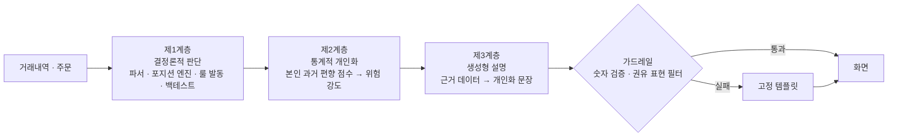

# 매매 브레이크 — 서비스 기획서

> 2026 금융 AI Challenge 출품작 · 제출: 2026-09-07 10:00

- 서비스 URL: https://brakefit.vercel.app
- 팀: 지종우(리더, 데이터 계약·포지션 엔진·웹·배포) · 최성범(파서·합성 데이터) · 강준일(편향 지표·브레이크 룰·가드레일) · 임승규(백테스트·API)
- 함께 제출: MVP 산출물 문서(화면·알고리즘·백테스트 수치·아키텍처·한계)

---

## 1. 개요

거래내역으로 개인의 행동 편향을 수치화하고, 같은 실수가 반복되기 직전에 개입하며, 그 개입의 효과를 본인의 데이터로 계산해 보여주는 소비자보호형 웹서비스다.

개인투자자의 손실은 정보가 부족해서 생기기보다, 같은 판단 습관이 반복되어 생긴다. 오른 종목은 서둘러 팔고 내린 종목은 버티며, 평가손실 종목에 돈을 더 넣고, 이미 급등한 종목을 뒤늦게 따라 산다. 이 세 가지는 행동재무학이 오래전부터 기술해 온 편향이지만, 정작 투자자 본인은 자신의 거래내역에서 그것을 숫자로 확인한 적이 없다. 진단이 없으니 교정도 없고, 같은 실수가 계좌 단위로 되풀이된다.

매매 브레이크는 증권사에서 내려받은 거래내역 파일 하나로 이 세 가지 편향을 0~100점으로 수치화하고, 같은 패턴의 주문이 들어오는 바로 그 순간에 화면을 멈춰 세운다. 개입의 근거는 시장 통념이나 일반론이 아니라 그 사람 자신의 과거 거래다. 그리고 "그때 멈췄다면 손익이 어떻게 달라졌을지"를 반사실 백테스트로 계산해, 유리하지 않은 결과까지 그대로 보여준다.

**핵심 가치**

| | 가치 | 내용 |
|---|---|---|
| ① | 개인 실증 기반 개입 | 경고의 강도가 전역 가중치가 아니라 사용자 본인의 과거 거래 통계에서 나온다. "왜 나에게 이 경고가 이만큼 세게 뜨는가"에 데이터로 답한다. |
| ② | 역할이 분리된 하이브리드 AI | 금전적 판단은 결정론적 규칙과 개인 통계가, 사용자와의 소통은 생성형 AI가 맡는다. 판정은 재현 가능하고, 설명은 개인의 실제 거래를 인용해 생성되며, 생성문은 숫자 검증과 권유 표현 필터를 통과해야만 화면에 나간다. 금융당국이 요구하는 설명가능성·책임성을 아키텍처로 구현한 분업이다. |
| ③ | 정직한 검증 | 개입의 효과를 반사실로 계산하는 기능을 서비스 안에 내장했다. 검증 구간에서 개입이 순손실로 나온 결과를 감추지 않고 그대로 화면에 띄운다. |

데모: https://brakefit.vercel.app · 구현 상세와 검증 수치는 MVP 산출물 문서.

---

## 2. 문제 정의와 배경

### 2.1 개인투자자가 반복하는 세 가지 실수

**처분효과.** 오른 종목은 서둘러 이익을 확정하고, 내린 종목은 손실을 확정하기 싫어 계속 들고 있는 경향이다. Odean(1998)이 개인 계좌 자료로 실현이익 비율과 실현손실 비율의 차이를 측정해 처음 체계적으로 보인 현상이다. 결과적으로 계좌에는 오래 물린 종목만 남고, 이익은 짧게 끊긴다.

**물타기.** 이미 평가손실 상태인 종목에 추가매수해 평균단가를 낮추는 행동이다. 판단이 틀렸다는 사실을 인정하지 않기 위해 같은 종목에 자금을 더 넣는 쪽으로 기울면, 한 종목에 노출이 집중되고 회복 국면이 오지 않을 때 손실이 급격히 커진다.

**추격매수.** 이미 크게 오른 종목을 더 오를 것이라 기대하고 뒤늦게 따라 사는 행동이다. 급등 뉴스와 커뮤니티 반응이 매수 근거를 대신하며, 진입 가격이 높아 되돌림 구간에서 곧바로 평가손실 상태가 된다.

세 가지 모두 개별 거래로 보면 합리적인 이유가 붙는다. 문제는 같은 유형의 판단이 한 사람의 계좌에서 반복된다는 점이고, 반복은 거래내역이라는 기록에 남는다.

### 2.2 왜 지금인가

모바일 거래 환경이 보편화되면서 20~30대의 직접 주식투자 진입 장벽이 사실상 사라졌다. 계좌 개설부터 첫 주문까지 몇 분이면 끝나고, 소수점 매매와 신용·미수 기능도 같은 화면 안에 있다. 진입은 쉬워졌지만 판단을 점검할 장치는 그만큼 늘지 않았다. 차입을 동반한 투자에서 발생한 손실은 청년층의 부채로 이어지고, 부채는 다시 회복을 위한 무리한 매매를 부른다. 이 고리를 끊는 개입은 손실이 확정된 뒤의 사후 상담이 아니라 주문이 실행되기 전에 이루어져야 한다.

규제 환경도 방향이 같다. 금융위원회·금융감독원의 「금융분야 AI 가이드라인」(2021) 및 후속 안내서는 금융 AI에 설명가능성과 책임성을 요구한다. 투자자에게 무엇을 사라고 말하는 AI보다, 투자자 자신의 판단 습관을 근거와 함께 되짚어 주는 AI가 이 기준에 정합적이다. 주문 실행 전 단계의 안내·확인 절차 자체는 이미 일부 증권사가 금융감독원 지도에 따라 고위험 주문 안전 알림 형태로 운영하고 있는 영역으로, 개입의 적법성보다는 "무엇을 근거로, 얼마나 개인화해서 개입하는가"가 비어 있는 부분이다.

### 2.3 기존 서비스의 공백

시중 서비스는 대체로 정보 제공과 종목 추천에 무게가 실려 있다. 일부 증권사는 투자패턴 분석 화면을 제공하지만 대부분 과거 성향을 보여주는 진단에서 끝나고, 안전 알림류 기능은 존재하되 근거가 전역 규칙에 머문다. 주문 직전에 본인 데이터 기반으로 개입하고, 그 개입이 실제로 얼마의 가치가 있었는지 사후에 계산해 보여주는 조합은 비어 있다.

| 서비스 유형 | 진단 | 주문 직전 개입 | 효과 검증 | 근거의 개인화 |
|---|---|---|---|---|
| 종목 추천·AI 리서치 | 없음 | 없음 | 없음 | 시장 데이터 기반 |
| 증권사 투자패턴 분석 화면 | 있음 | 없음 | 없음 | 본인 거래 기반 |
| 증권사 고위험 주문 안전 알림 | 없음 | 있음(전역 규칙) | 없음 | 없음 |
| 자산관리·가계부 앱 | 자산 현황 중심 | 없음 | 없음 | 본인 자산 기반 |
| 매매 브레이크 | 있음 | 있음 | 있음 | 본인 거래 기반 |

---

## 3. 서비스 컨셉

### 3.1 진단 · 개입 · 증명

| 단계 | 사용자가 보는 것 | 서비스가 하는 일 |
|---|---|---|
| ① 진단 | 편향 3종의 점수·등급·백분위와 근거 사례 | 거래내역과 일봉으로 일별 포지션을 재구성하고, 편향별 점수를 계산한다 |
| ② 개입 | 주문 직전의 위험 게이지, 기여도 분해, 본인 이력을 인용한 경고문 | 주문 시점까지의 정보만으로 브레이크 룰을 판정하고, 본인의 과거 편향 점수에 비례한 위험 기여를 산출하며, 근거 데이터를 생성형 AI가 경고 문장으로 옮긴다 |
| ③ 증명 | 회피한 손실과 놓친 이익, 그 차이인 순효과 | 브레이크가 걸렸을 과거 매수를 반사실로 제거하고 이후 실제 가격으로 손익을 다시 계산한다 |

### 3.2 설계 원칙

① **근거는 본인의 과거 거래다.** 위험 점수의 크기는 그 사람의 과거 편향 점수에 비례한다.

② **미래 정보를 참조하지 않는다.** 브레이크 판정과 백테스트의 개입 재현은 주문 시점에 알 수 있는 정보만 사용한다. 사후 가격은 오직 결과 평가에만 쓴다. 이 경계는 시세 조회 지점 한 곳으로 모았고, 회귀 테스트로 고정했다.

③ **검증은 정직하게 한다.** 반사실 백테스트를 서비스에 내장하고, 결과가 불리하게 나와도 유리한 기간을 골라 다시 돌리지 않는다. 현재 검증 구간에서 개입은 순손실이며, 그 사실과 원인을 그대로 표시한다.

④ **규제를 준수하고 중립을 지킨다.** 데이터 확보 경로는 사용자가 직접 내려받은 파일의 업로드 하나뿐이다. 마이데이터 연동은 별도 인가가 필요한 영역이므로 어댑터 인터페이스만 남겨 두고 로드맵으로 미뤘다. 어떤 화면에서도 특정 상품이나 종목을 권유하지 않으며, 생성문에서 권유·전망 계열 표현은 필터로 차단한다.

---

## 4. AI 아키텍처

이 서비스에서 AI는 "판단하는 AI"가 아니라 "판단을 개인화하고 전달하는 AI"다. 세 계층으로 분업한다.

**제1계층 — 결정론적 판단.** 파서, 포지션 엔진, 브레이크 룰의 발동 조건, 백테스트는 전부 결정론적 규칙이다. 같은 입력에는 언제나 같은 판정이 나오고, 판정 경로 전체를 화면에서 역추적할 수 있다.

**제2계층 — 통계적 개인화.** 발동한 규칙이 얼마나 심각한지는 사용자 본인의 과거 편향 점수가 정한다. 같은 급등 매수라도 추격매수 이력이 없는 사용자에게는 낮은 위험 점수와 옅은 경고가, 반복된 사용자에게는 높은 점수와 강한 경고가 간다. 트리거는 보편적 안전선으로 두되(이력이 없는 사용자의 첫 반복도 잡아야 하므로), 개입의 강도·등급·문구를 개인 실증에 결부한 구조다.

**제3계층 — 생성형 설명.** 확정된 판정과 근거 데이터(발동 규칙, 유사 사례 목록, 본인 점수)를 생성형 AI(Claude Haiku)가 사용자 언어로 옮긴다. 고정 템플릿이 "추격매수 패턴이 감지됩니다"라고만 말할 때, 생성문은 "지난 3월 한 종목을 전일 대비 6.1% 급등가에 매수한 것을 포함해 같은 패턴이 14건 있었고 평균 급등률은 7.7%였다"처럼 그 사람의 실제 이력을 문장에 녹인다. 개입 문구가 일반론이 아니라 자기 기록의 요약일 때 행동 교정 메시지의 설득력이 달라진다는 것이 이 계층의 존재 이유다. 생성문은 숫자 검증과 권유 표현 필터로 이루어진 가드레일을 통과해야만 화면에 나간다. 가드레일의 구현 세부는 MVP 산출물 3장에 있다.

**왜 판단 계층에 ML/LLM을 쓰지 않았는가.** 첫째, "이 주문이 편향이다"를 학습시킬 정답 데이터가 세상에 없다. 편향 여부는 사후 수익률로 정의되지 않으므로(수익이 난 추격매수도 추격매수다), 수익률을 라벨로 쓰는 순간 정의가 순환한다. 둘째, 금전적 개입의 근거는 사용자가 검증할 수 있어야 하고, 규제가 요구하는 설명가능성과도 직결된다. 판단을 규칙과 본인 통계에, 언어를 생성형 AI에 배정한 이 분업은 제약이 아니라 금융 도메인에서 생성형 AI를 쓰는 올바른 자리 배치이며, 「금융분야 AI 가이드라인」의 설명가능성·책임성 요건을 기능 수준으로 옮긴 설계다.

---

## 5. 사용자 시나리오

### 5.1 타깃 사용자

모바일 거래 앱으로 국내 주식을 직접 매매하는 20~30대 개인투자자다. 투자 경력이 길지 않고, 매매 판단의 근거가 뉴스·커뮤니티·직전 수익률에 크게 의존하며, 자신의 거래 습관을 통계로 본 적이 없는 사용자를 상정한다. 해외주식, 파생상품, 실시간 시세, 실제 주문 연동은 이번 범위 밖이다.

### 5.2 대표 시나리오

20대 후반 직장인 A는 급등 종목을 뒤늦게 따라 사는 습관이 있다. 오르는 종목을 보면 더 오를 것 같아 일단 사고, 며칠 뒤 되돌림이 오면 평단을 낮추려 한 번 더 산다. 계좌 잔고는 알지만 자신이 어떤 상황에서 매수 버튼을 누르는지는 모른다.

A는 증권사 앱에서 거래내역을 내려받아 매매 브레이크에 올린다. 잠시 뒤 화면에 세 개의 점수가 뜬다. 추격매수 점수가 가장 높고, 같은 조건으로 만든 합성 기준선 대비 상위 5%라는 표시가 붙는다. 아래에는 근거가 된 실제 매수 건들이 급등률과 함께 나열돼 있다. 며칠 뒤 A는 다시 급등한 종목을 보고 모의 주문창에 매수 주문을 넣는다. 주문 버튼을 누르는 순간 화면이 멈추고, 기준 종가 대비 8% 높은 가격이라는 사실과 함께 A의 과거 매수 이력을 인용한 경고 — 같은 방식의 매수 14건, 매수 시점 평균 급등률 — 가 뜬다. 위험 점수가 어떤 편향에서 얼마씩 왔는지도 함께 표시된다. A는 주문을 멈추고 백테스트 화면으로 넘어가, 자신의 습관이 지난 기간 동안 금액으로 얼마였는지를 확인한다.

---

## 6. 검증 철학

브레이크의 효과는 주장으로 증명할 수 없다. 그래서 반사실 백테스트를 서비스 안에 내장했다. 과거 매수 하나하나에 대해 그 시점까지의 정보만으로 브레이크를 재현하고, 개입 대상으로 판정된 매수를 없었던 것으로 가정해 이후의 실제 가격으로 회피한 손실과 놓친 이익을 계산한다. 결과가 불리하게 나와도 유리한 기간을 골라 다시 돌리지 않으며, 화면과 문서에 그대로 공개한다. 실제로 현재 검증 구간(합성 페르소나, 국내 증시 상승 국면)에서는 다섯 페르소나 모두 개입의 순효과가 음수다. 이 결과와 원인 분해, 해석은 MVP 산출물 4장에 있다.

이 기능은 수익률 개선을 약속하는 마케팅 장치가 아니라 사용자의 편향에 가격표를 붙이는 계산기다. 자신의 물타기 습관이 지난 반년 동안 금액으로 얼마였는지를 본인의 거래로 확인하는 경험 자체가 진단·개입의 설득력을 만든다. 이 서비스가 파는 것은 "브레이크를 걸면 돈을 번다"는 약속이 아니라 "당신의 편향이 얼마짜리였는지 본인 데이터로 정직하게 계산해 주는 도구"이며, 음수를 그대로 띄우는 것이 그 정직성의 증거다. 사용자는 화면에 뜨는 숫자가 서비스에 유리하게 선택된 값이 아니라는 것을 결과 자체로 확인할 수 있다.

---

## 7. 차별점과 기대효과, 활용 방안

### 7.1 유사 서비스 대비

| 비교 축 | 종목 추천형 AI 서비스(일반적 형태) | 매매 브레이크 |
|---|---|---|
| 데이터 출처 | 시장 데이터, 종목 재무 | 사용자 본인의 체결 내역 |
| 산출물 | 종목 추천, 시황 요약 | 본인의 판단 습관 점수와 근거 사례 |
| 개입 시점 | 없음 또는 사후 리포트 | 주문 실행 직전 |
| AI의 역할 | 모델이 판단하고 그 출력을 제시 | 판단은 규칙+본인 통계, 생성형 AI는 근거를 개인화 문장으로 전달(검증 통과 시에만 채택) |
| 효과 검증 | 수익률 예시 중심 | 반사실 백테스트 내장, 불리한 결과 포함 공개 |
| 규제 정합성 | 권유·전망 요소를 포함하는 경우가 많음 | 권유 없음, 권유·전망 표현을 필터로 차단 |

### 7.2 사회적 가치

이 서비스는 수익을 늘리는 도구가 아니라 손실의 반복을 줄이는 도구다. 특히 투자 경험이 짧은 청년층에게, 자신의 매매 기록이 통계로 무엇을 말하는지를 처음으로 보여준다. 개입 시점을 주문 직전으로 잡은 이유도 여기에 있다. 손실이 확정된 뒤의 상담은 이미 늦고, 차입을 동반한 손실은 회복을 위한 무리한 매매를 다시 부르기 때문이다. 어떤 화면에서도 상품이나 종목을 권유하지 않으므로, 소비자보호 목적과 서비스의 수익 동기가 충돌하지 않는다.

### 7.3 금융회사 관점의 활용

- **주문 화면 플러그인.** 브레이크 판정은 주문 정보와 그 사용자의 과거 체결 내역만 있으면 동작한다. 증권사 거래 앱의 주문 확인 단계에 얹으면 별도 화면 이동 없이 개입이 가능하다.
- **마이데이터 연동 시 업로드 불필요.** 데이터 입력 경로를 어댑터 인터페이스로 분리해 두었다. 인가 사업자가 연동하면 파일 업로드 단계 없이 같은 파이프라인이 동작하고, 엔진 이후는 전혀 바뀌지 않는다.
- **불완전판매 리스크가 없는 안내.** 상품 권유가 구조적으로 불가능한 설계이므로, 금융회사가 고객 보호 지표를 개선하는 용도로 도입할 때 판매 규제와 충돌하지 않는다.

### 7.4 확장성

증권사 화면 하나를 추가하는 비용은 매핑 정의 파일 하나와 테스트 세트 하나다. 파서 이후의 모든 모듈은 표준 거래내역만 보기 때문에 원본 형식을 알지 못하며, 따라서 증권사가 늘어나도 지표·룰·백테스트는 그대로다. 지표 추가도 동일하다 — 점수와 근거 사례를 반환하는 같은 형태를 따르면 진단 화면과 브레이크 룰에 함께 편입된다.

---

## 8. 로드맵

| 시기 | 과제 | 목적 |
|---|---|---|
| 단기 | 하락장·횡보장 구간 백테스트 | 결과의 기간 의존성 해소, 국면별 효과 제시 |
| 단기 | 종목명·종목코드 사전 동봉 | 외부 조회 없이 증권사 화면 파일의 종목 인식률 확보 |
| 단기 | 처분효과의 반사실 정의 확정 | 편향 3종 전체를 금액으로 증명 |
| 중기 | 증권사 화면 지원 확대 | 매핑 정의 추가로 대상 사용자 확장 |
| 중기 | 실사용자 표본 기반 백분위·문턱값 보정 | 합성 기준선과 설계값을 실제 분포로 교체 |
| 중기 | 손절지연·회전율 지표 추가 | 편향 진단 범위 확대 |
| 중기 | 대화형 회고 코칭 | 진단 근거 데이터로 답변 범위를 한정한 생성형 AI 질의응답("내 물타기 사례를 월별로 보여줘") — 가드레일 패턴 재사용 |
| 장기 | 마이데이터 연동 | 파일 업로드 없이 자동 진단 |
| 장기 | 증권사 거래 앱 내장 | 실제 주문 흐름 안에서의 개입 |

현재 한계는 MVP 산출물 6장에 정리했다.
