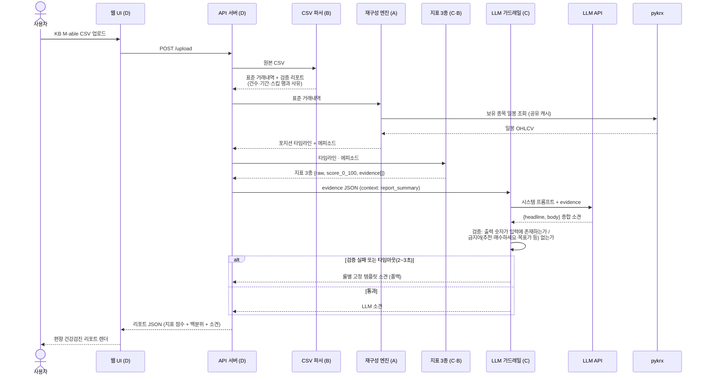
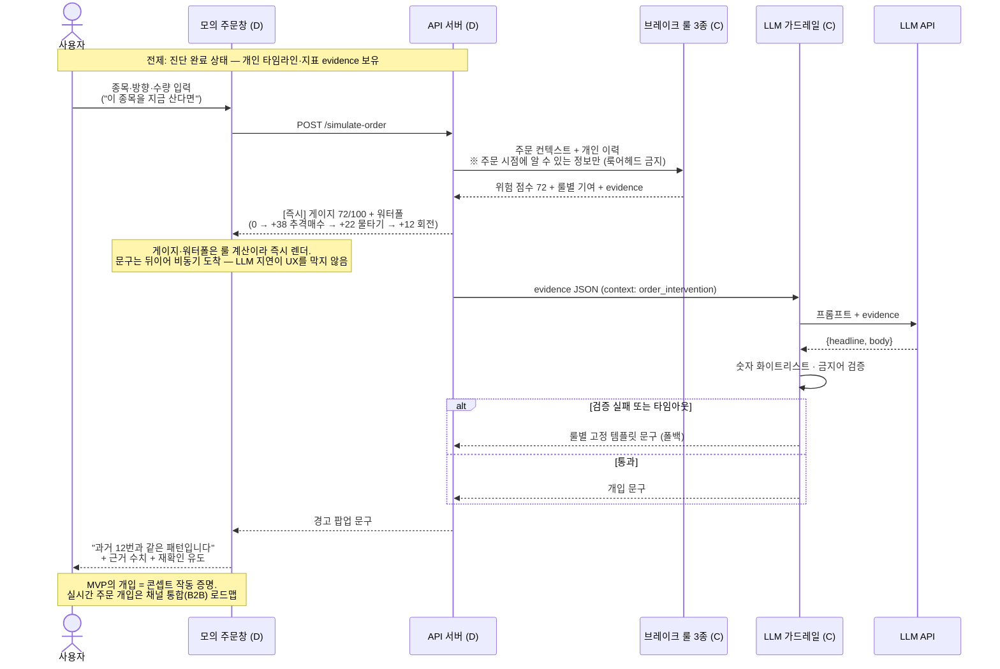

# 매매 브레이크 — 핵심 플로우 시퀀스 다이어그램

> 목적: "게이지·워터폴·개입이 실제로 어떻게 동작하는가"를 시간 순서로 공유. D의 목 API 서버는 이 시퀀스의 canned 버전이며, 통합(9/4)은 목을 진짜 모듈로 교체하는 작업이다.
> 위치: 레포 `docs/sequences.md`

## ① 진단 플로우 — CSV 업로드 → 편향 건강검진 리포트

## ② 개입 플로우 — 모의 주문 → 게이지·워터폴 → 경고 팝업

## 읽는 법 · 킥오프 확인 포인트

- **판단과 언어의 분리가 시간축에 보인다**: 두 플로우 모두 점수·판정(룰)이 먼저 확정되고, LLM은 그 결과를 문구로 번역할 뿐 판단에 관여하지 않는다. 폴백이 발동해도 점수·게이지는 그대로 — 서비스 핵심 기능은 LLM 장애와 무관
- **데모 안정성 장치**: 시연용 페르소나 3종의 LLM 문구는 사전 생성·캐시 → 시연장에서 외부 API 실패 확률 0
- [ ] C: 룰 응답과 evidence JSON 구조가 api.md 초안과 일치하는지 확인
- [ ] D: 목 서버의 canned 응답을 이 시퀀스 순서 그대로 구성
- [ ] 전원: 자기 participant 구간의 입출력에 이견 없는지 확인
