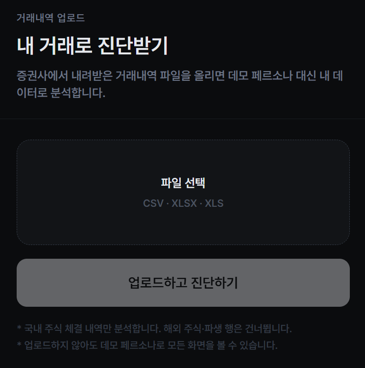
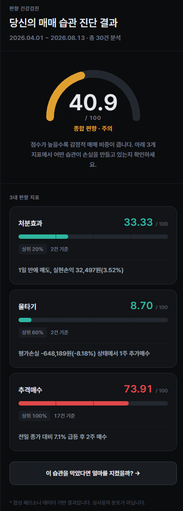
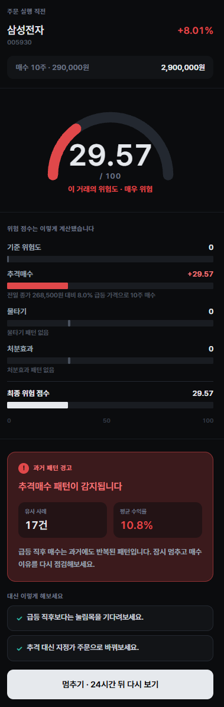
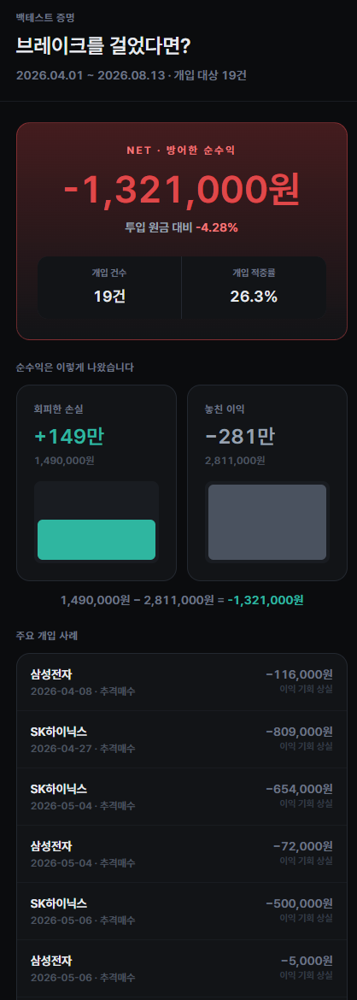

# 매매 브레이크 — 기능 명세서

> 2026 금융 AI Challenge 제출물. 제출: 2026-09-07 10:00.
> 이 파일이 원본. 마감 시 인쇄용 HTML 로 변환해 PDF 제출.
> `[담당]` 표시된 섹션을 각자 채운다. `TODO:` 는 미확정 항목. **수치는 §7 백테스트 확정 전에 쓰지 않는다**(AGENTS.md 규칙 5).

- 서비스 URL: TODO (Vercel)
- API 문서: TODO (Render `/docs`)
- 레포: https://github.com/durinnn/brakefit
- 팀: A 김종우(리더·엔진) / B (파서·합성) / C (지표·룰·가드) / D (백테스트·API·웹·배포)

---

## 1. 요약 [A]

한 문단. 문제 → 해법 → 데모에서 보여주는 것 3줄.

- **문제**: 개인투자자는 같은 실수(처분효과·물타기·추격매수)를 반복하지만 자기 거래내역에서 그걸 수치로 본 적이 없다.
- **해법**: 거래내역 CSV 하나로 편향 3종을 0~100 점수화하고, 같은 패턴의 주문을 넣으려는 순간 브레이크를 건다.
- **데모**: 업로드 → 진단 리포트 → 모의 주문창 개입 팝업 → 반사실 백테스트.

## 2. 대상 사용자와 시나리오 [A]

- 대상: 2030 개인투자자, KB증권 MTS/HTS 사용자(거래내역 export 가능).
- 핵심 시나리오 (90초 데모 흐름):
  1. 거래내역 CSV 업로드
  2. 대시보드에서 편향 점수·등급·근거 확인
  3. 모의 주문창에서 물타기성 매수 입력 → 브레이크 팝업
  4. 백테스트 탭에서 "브레이크를 따랐다면" 손익 확인
- 비대상(범위 밖): 해외주식, 파생, 실시간 시세, 실제 주문 연동.

## 3. 기능 목록

| # | 기능 | 화면 | API | 상태 |
|---|---|---|---|---|
| F1 | 거래내역 업로드 (표준 CSV · KB 화면 3종) | `/upload` | `POST /api/upload` | 완료 |
| F2 | 편향 진단 리포트 (3종 점수·등급·백분위·근거) | `/dashboard` | `GET /api/diagnose` | 완료 |
| F3 | 모의 주문 개입 (브레이크 룰 판정 + LLM 문구) | `/trade` | `POST /api/simulate-order` | 완료 |
| F4 | 반사실 백테스트 (회피 손실 − 놓친 이익) | `/backtest` | `GET /api/backtest` | 완료 (BUY 편향 2종) |
| F5 | 합성 페르소나 데모 모드 (업로드 없이 체험) | 전 화면 | `?persona=` | 완료 |
| F6 | 데이터 품질 경고 (과매도·종목코드 미해결) | `/dashboard` 배너 | 응답 `warnings` | 완료 |

## 4. 화면 명세 [D]

각 화면: 스크린샷 1장 + 표시 항목 + 사용자 행동 + 예외 상태(로딩·오류·세션 만료).

> ⚠ 스크린샷 파일(`docs/img/*.png`)은 아래 내용 확정 후 브라우저에서 직접 캡처해 넣을 것.
> 이 문서를 쓰며 로컬(`dev` 브랜치, 데모 페르소나 `chasing_prone`)에서 직접 확인한 실제 화면 기준으로 작성함.

### 4.1 업로드 `/upload`



**표시 항목**
- (업로드 전) 드래그/클릭 파일 선택 영역 — 선택 시 파일명·용량(KB)으로 갱신, 안내문 2줄("국내 주식 체결 내역만 분석", "업로드 안 해도 데모 페르소나로 전 화면 열람 가능")
- (업로드 후) 결과 카드 — 거래 건수·기간, 인식된 형식 배지(KB증권 거래내역 / 표준 CSV), 제외된 행 수
- 확인이 필요한 항목 목록(경고, `warnings.length > 0`일 때만 노란 테두리 박스)
- "진단 보기" / "다른 파일 올리기" 버튼

**사용자 행동**
1. 파일 선택(`accept=".csv,.xlsx,.xls"`) → 업로드 버튼은 파일 없으면 비활성화
2. "업로드하고 진단하기" 클릭 → 성공 시 결과 카드로 전환
3. "진단 보기" → `/dashboard`로 **전체 페이지 이동**(클라이언트 라우팅이 아님 — 방금 심은 세션 쿠키를 서버 컴포넌트가 확실히 읽게 하려는 의도적 설계, [web/src/app/upload/page.tsx:45-49](web/src/app/upload/page.tsx:45))
4. "다른 파일 올리기" → 상태 초기화, 같은 화면 재사용

**예외 상태**
- 로딩: 별도 스켈레톤 없음 — 버튼 텍스트가 "업로드하고 진단하기" → "분석 중…"으로 바뀌고 버튼 비활성화되는 인라인 방식
- 오류: 빨간 테두리 박스에 "업로드 실패" + 백엔드가 준 한국어 사유(400 응답의 `detail`) 또는 실패 시 `업로드에 실패했습니다 (상태코드)` 폴백. 크기 초과(413)도 같은 방식으로 노출
- 세션: 성공 시 `sessionId`를 쿠키(`bf_session`)에 저장, 유효기간 7일 — "백엔드 세션이 먼저 만료될 수 있다"고 코드에 명시([web/src/lib/session.ts:15](web/src/lib/session.ts:15))

### 4.2 진단 대시보드 `/dashboard`



**표시 항목**
- 상단 데이터 출처 배지 — "데모 페르소나" 또는 "내 거래내역 · N건", 반대쪽 화면으로 가는 링크("내 거래내역 올리기" / "데모로 되돌리기")
- 경고 배너(`WarningBanner`) — 데이터 품질 경고가 있을 때만 노란 줄로 노출(F6). 예: 종목코드 미해결, 보유수량 초과 매도 등
- 종합 편향 아크게이지(0~100) + 등급(안정/주의/위험)
- 지표 3종 카드 — 점수(소수 둘째자리), 진행바, 백분위("상위 N%"), 표본 건수, 근거 한 줄
- 하단 CTA "이 습관을 막았다면 얼마를 지켰을까?"
- 합성 데이터 각주(`SynthDisclaimer`) — 데모 페르소나일 때만 노출, 내 거래내역이면 안 뜸

**사용자 행동**
- 배지의 링크로 데모 ↔ 내 거래내역 전환
- CTA 클릭 → `/backtest` 이동
- 하단 탭(`BottomNav`)으로 다른 화면 이동

**예외 상태**
- 로딩: [web/src/app/dashboard/loading.tsx](web/src/app/dashboard/loading.tsx) — 배지·헤더·게이지·카드3개·CTA 자리를 골격(`animate-pulse`)으로 미리 보여줌. Render 무료 플랜의 콜드스타트가 길어서 백지 대신 골격을 두기로 한 설계
- 오류: 전역 [web/src/app/error.tsx](web/src/app/error.tsx) — "서버 연결에 실패했습니다" 한국어 안내 + "다시 시도"/"홈으로" 버튼. Next.js 기본 영어 에러 화면이 데모 중 뜨는 걸 막기 위함
- 세션 만료: 업로드 세션으로 조회했는데 서버가 404(세션 모름)를 주면 **조용히 데모 페르소나로 폴백** — 배지에 "(업로드 세션 만료됨)" 문구가 붙고, 클라이언트가 만료된 쿠키를 자동으로 정리함([web/src/lib/api.ts:66](web/src/lib/api.ts:66), [web/src/components/DataSourceBadge.tsx:27](web/src/components/DataSourceBadge.tsx:27))

### 4.3 모의 주문창 `/trade`



**표시 항목**
- 주문 요약 — 종목명·코드, 전일 대비 등락률, "매수 N주 · 단가", 총액
- 위험 게이지(0~100) + 등급(낮음/주의/매우 위험)
- 기여도 워터폴 — 기준 위험도 → 추격매수 → 물타기 → 처분효과 → 최종 위험 점수, 항목별 근거 문구
- **개입 임계값(50점) 이상일 때만**: "과거 패턴 경고" 박스(헤드라인 + 유사 사례 건수 + 평균 수익률 + 설명), 대안 제안 목록, "멈추기·24시간 뒤 다시 보기" / "경고를 무시하고 주문 진행" 버튼
- 합성 데이터 각주(`SynthDisclaimer`) — 데모 페르소나일 때만

**사용자 행동**
- (현재 주문 입력 UI 없음 — `DEMO_ORDER` 고정값으로만 렌더, [web/src/lib/api.ts:132-138](web/src/lib/api.ts:132))
- 위험도가 임계값을 넘으면: "멈추기" 클릭 → "주문을 멈췄습니다" 확인 화면(로컬 상태 전환만, "되돌리기"로 재확인 가능)
- "경고를 무시하고 주문 진행" 클릭 → 2단계 확인 박스("정말 진행하시겠습니까?") → "그래도 매수" 클릭 → "주문이 접수되었습니다. 이 거래는 '경고 후 강행'으로 기록되어 다음 진단에 반영됩니다" 표시
- ⚠ **문구가 실제 동작을 과장함**: 위 "멈추기"/"그래도 매수" 결정은 [web/src/components/InterventionActions.tsx](web/src/components/InterventionActions.tsx)의 **순수 클라이언트 로컬 상태**일 뿐, 실제로 서버에 기록되거나 다음 진단에 반영되는 API 호출이 없음. "다음 진단에 반영됩니다" 문구는 아직 구현되지 않은 기능을 있는 것처럼 말하고 있어 **수정이 필요함**

**예외 상태**
- 로딩: [web/src/app/trade/loading.tsx](web/src/app/trade/loading.tsx) — dashboard와 동일한 스켈레톤 패턴
- 오류: 전역 `error.tsx` 공통 적용
- 세션 만료: dashboard와 동일한 폴백 메커니즘(서버 fetch 단계는 동일). 단, `DataSourceBadge`는 `/dashboard`에만 있고 이 화면엔 없어서 — 폴백이 조용히 일어나도 사용자에게 "지금 보는 게 데모로 바뀌었다"는 안내가 안 뜸(`/backtest`도 동일, 아래 참조) — D가 확인 필요한 지점

### 4.4 백테스트 `/backtest`



**표시 항목**
- 기간·개입 대상 건수
- NET 카드 — 순수익 금액·비율. **부호에 따라 색상이 갈림**(양수=safe 초록, 음수=risk 빨강 — 지난 버그 수정 반영됨)
- 개입 건수 · 개입 적중률
- 회피한 손실 / 놓친 이익 막대바 2개 + 계산식("1,490,000원 − 2,811,000원 = -1,321,000원")
- 주요 개입 사례 목록 — 날짜·종목명·편향 종류·impact 금액
- 합성 데이터 각주(`SynthDisclaimer`) — 데모 페르소나일 때만

**사용자 행동**
- 스크롤로 사례 목록 확인 — 그 외 인터랙션 없는 읽기 전용 화면

**예외 상태**
- 로딩: [web/src/app/backtest/loading.tsx](web/src/app/backtest/loading.tsx)
- 오류: 전역 `error.tsx` 공통 적용
- 세션 만료: dashboard와 동일한 폴백 메커니즘(단, `/trade`와 마찬가지로 `DataSourceBadge`가 없어 폴백 안내가 화면에 안 뜸)

## 5. 편향 정의와 점수 산식 [C]

각 편향: 정의 1줄 → 거래내역에서 잡는 방법 → 점수 0~100 산식 → 등급 컷 → 근거(evidence) 예시.

### 5.1 처분효과 (disposition)
TODO
### 5.2 물타기 (averaging_down)
TODO
### 5.3 추격매수 (chasing)
TODO
### 5.4 종합 점수와 백분위
- 가중치 40/35/25 (`core/rules` MAX_CONTRIBUTION 재사용)
- 백분위 기준선: 합성 페르소나 5종 분포 — **실사용자 분포 아님**(각주 필수)
- TODO: 합리형 페르소나 chasing 기준선 50.00 원인·처리

## 6. 브레이크 룰 [C]

각 룰: 트리거 조건(주문 시점 정보만) → 임계값 → 개입 문구 생성(LLM + 템플릿 폴백) → 가드레일(숫자 화이트리스트·금지어·타임아웃 2.5s).

- 룩어헤드 금지 원칙 명시: 판정에 쓰는 정보는 주문 시점 `as_of` 이전 데이터뿐
- TODO: 룰 3종 조건표

## 7. 백테스트 방법과 결과 [D → A 결정]

- 방법: 브레이크가 걸린 BUY 주문을 반사실적으로 제거하고 이후 N일 가격으로 손익 비교. 처분효과(SELL)는 반사실 정의가 달라 v1 제외(근거: `core/backtest/backtest.py` docstring).
- 룩어헤드: 판정은 주문 시점, 평가만 사후 가격.

> ⚠ **아래 표·각주는 D 초안이며 A 확정 전까지는 기획서 본문(§1 요약 등)에 인용하지 않는다**
> (AGENTS.md 규칙 5, 본 문서 §0 안내). `GET /api/backtest`를 페르소나 5종 전부에 직접 호출해
> 받은 실제 값이지만, 캐시된 3종목·고정 기간 기준이라 팀이 "이 숫자를 제출용으로 쓸지"를
> 별도로 확정해야 한다.

**페르소나별 결과표**

| 페르소나 | 기간 | 개입 건수 | 회피한 손실 | 놓친 이익 | Net | Net% | 적중률 |
|---|---|---:|---:|---:|---:|---:|---:|
| 차분형(대조군) `rational_baseline` | 2026.03.13~08.13 | 8 | 615,000 | 447,500 | **+167,500** | +1.08% | 50.0% |
| 처분효과형 `disposition_prone` | 2026.02.19~08.14 | 8 | 59,500 | 399,500 | −340,000 | −2.15% | 37.5% |
| 물타기형 `averaging_down_prone` | 2026.02.05~08.13 | 16 | 276,000 | 1,282,000 | −1,006,000 | −5.10% | 31.2% |
| 추격매수형 `chasing_prone` | 2026.04.01~08.13 | 19 | 1,490,000 | 2,811,000 | −1,321,000 | −4.28% | 26.3% |
| 복합형(데모 기본값) `mixed_realistic` | 2025.12.04~08.18 | 17 | 154,000 | 911,700 | −757,700 | −4.07% | 23.5% |

**상승장 한계 각주**

> \* 이 결과는 검증 기간(2025.12~2026.08) KRX 캐시 시세를 기준으로 한 반사실 시뮬레이션이다.
> 해당 기간이 대체로 상승장이었기 때문에 "브레이크가 걸려 매수를 막았어도 어차피 나중에
> 올랐을" 확률이 구조적으로 높다 — **물타기·추격매수처럼 매수를 막는 방향의 브레이크는
> 상승장에서 놓친 이익이 커져 net_benefit 이 음수로 나오기 쉽다.** 실제로 5개 페르소나 중
> 4개(처분효과형·물타기형·추격매수형·복합형)에서 순손실이 나왔고, 편향이 가장 약한
> 대조군(차분형)만 순이익이 나왔다 — **편향이 강할수록 이 기간 기준으로는 오히려 브레이크의
> 순효과가 나빠 보이는 역설**이 있다. 이는 브레이크 로직의 결함이 아니라 **검증 기간의
> 시장 국면에 결과가 의존한다는 한계**이며, 하락장·횡보장 구간을 추가로 검증하지 않는 한
> 이 수치를 "브레이크가 실제로 도움이 된다"는 일반적 근거로 제시하면 안 된다.

**데모 시나리오상 주의점**: §2의 핵심 시나리오는 "백테스트 탭에서 '브레이크를 따랐다면' 손익
확인"인데, 데모 기본값(`mixed_realistic`)을 포함해 편향이 있는 4개 페르소나 전부 **순손실**로
나온다. 데모에서 이 탭을 그대로 보여주면 "브레이크가 오히려 손해"라는 인상을 줄 수 있어
A가 시연 각도(다른 기간으로 재검증 / 각주를 화면에도 노출 / 데모 스크립트 조정 등)를
결정해야 함.

- 각주: 합성 페르소나 결과, 실사용자 분포 아님.

## 8. 데이터 [B]

- 입력 형식: 표준 CSV 스키마(`docs/schema.md` §1) + KB 화면 3종 매핑(YAML)
- `fee`/`tax` None(미제공)과 0(실제 0원) 구분
- 합성 페르소나 5종 생성 원리 (Monte Carlo + pykrx 실제 시세)
- 시세: pykrx 일봉, parquet 캐시(레포 동봉, 네트워크 없이 동작)
- 개인정보: 원본은 서버 메모리 세션에만, 디스크 저장 없음, 50세션 LRU
- TODO: 실 KB export 검증 결과 (해외주식 1건 파싱 확인, 국내 1건 대기)

## 9. 시스템 구성 [D]

- 다이어그램: `docs/architecture.md` mermaid 재사용
- Vercel(Next.js 15, sin1) → Render(FastAPI, Singapore) → pykrx / Anthropic Haiku
- 배포 브랜치 main, 슬립 방지 크론 핑, 서버 기동 시 기준선 프리워밍
- 보안 범위: 인증 없음(데모), CORS 개방, 업로드 5MB 상한, API 키는 Render 환경변수

## 10. 한계와 다음 단계 [A]

- 국내주식 전용, KB증권만, 세션 비영속(재배포 시 소멸)
- 백테스트 기간 의존성, 처분효과 백테스트 미구현
- 다음: MyData API 어댑터(동일 `TradeDataSource` 인터페이스), 증권사 매핑 추가는 YAML 1개
- TODO

## 부록

### 부록 A. API 응답 예시 [D]

> `mixed_realistic`(데모 기본값) 페르소나로 로컬에서 직접 호출해 받은 실제 응답.
> **형태(shape) 확인용 예시**일 뿐, 헤드라인 수치로 쓰지 않는다(§7·AGENTS.md 규칙 5).

#### `GET /api/diagnose`

```json
{
    "periodLabel": "2025.12.04 ~ 2026.08.18",
    "totalTrades": 34,
    "overallScore": 38.9,
    "overallGrade": "안정",
    "metrics": [
        {
            "key": "disposition",
            "name": "처분효과",
            "score": 62.5,
            "percentile": 80.0,
            "summary": "1일 만에 매도, 실현손익 190,081원(11.27%)",
            "sampleCount": 2,
            "delta": null
        },
        {
            "key": "averaging_down",
            "name": "물타기",
            "score": 21.73913043478261,
            "percentile": 80.0,
            "summary": "평가손실 -62,234원(-4.0%) 상태에서 2주 추가매수",
            "sampleCount": 5,
            "delta": null
        },
        {
            "key": "chasing",
            "name": "추격매수",
            "score": 39.130434782608695,
            "percentile": 60.0,
            "summary": "전일 종가 대비 6.1% 급등 후 1주 매수",
            "sampleCount": 9,
            "delta": null
        }
    ],
    "generatedAt": "2026-09-04T23:07:59",
    "headline": "행동 편향이 감지되었습니다",
    "body": "과거 거래 패턴에서 처분효과, 물타기, 추격매수 경향이 분석되었습니다. 아래 지표를 참고해 매매 습관을 점검해보세요.",
    "warnings": []
}
```

#### `POST /api/simulate-order`

요청 예시: `{"ticker":"005930","name":"삼성전자","side":"BUY","quantity":10,"price":290000}`

```json
{
    "order": {
        "ticker": "005930",
        "name": "삼성전자",
        "side": "BUY",
        "quantity": 10,
        "price": 290000.0,
        "changeRate": 21.09
    },
    "riskScore": 15.65,
    "riskLevel": "LOW",
    "baseScore": 0.0,
    "contributions": [
        {
            "label": "추격매수",
            "value": 15.65,
            "detail": "전일 종가 239,500원 대비 21.1% 급등 가격으로 10주 매수"
        },
        {
            "label": "물타기",
            "value": 0.0,
            "detail": "물타기 패턴 없음"
        },
        {
            "label": "처분효과",
            "value": 0.0,
            "detail": "처분효과 패턴 없음"
        }
    ],
    "warning": {
        "headline": "추격매수 이력이 있지만 위험 수준은 아님",
        "caseCount": 9,
        "averageReturn": 28.84,
        "description": "과거에 비슷한 패턴이 있었지만, 이번 주문의 종합 위험점수는 개입 기준에 못 미칩니다."
    },
    "suggestions": [
        "평소 패턴과 크게 다르지 않습니다. 계획대로 진행해도 좋습니다."
    ]
}
```

#### `GET /api/backtest`

`cases`는 실제로 17건 응답되나, 형태 확인용으로 3건만 남기고 생략함.

```json
{
    "periodLabel": "2025.12.04 ~ 2026.08.18",
    "interventionCount": 17,
    "avoidedLoss": 154000.0,
    "missedGain": 911700.0,
    "netBenefit": -757700.0,
    "netBenefitRate": -4.07,
    "hitRate": 23.5,
    "cases": [
        {
            "date": "2025-12-08",
            "name": "SK하이닉스",
            "impact": 6000.0,
            "biasKey": "chasing"
        },
        {
            "date": "2026-02-06",
            "name": "NAVER",
            "impact": -7000.0,
            "biasKey": "averaging_down"
        },
        {
            "date": "2026-04-30",
            "name": "NAVER",
            "impact": -340000.0,
            "biasKey": "averaging_down"
        }
    ],
    "warnings": []
}
```

- B. 표준 CSV 스키마 요약 [B]
- C. 테스트 현황: pytest 175개, 채점표 기반(엔진·지표·백테스트) [A]
