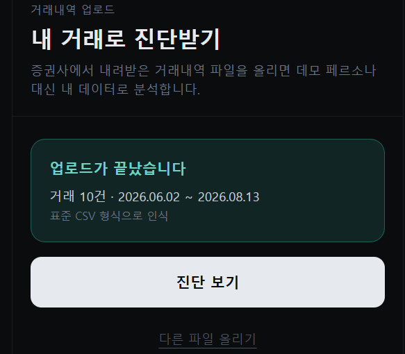
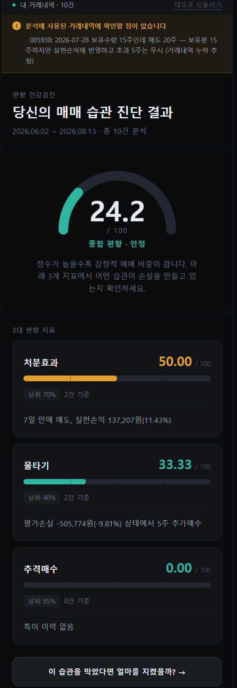
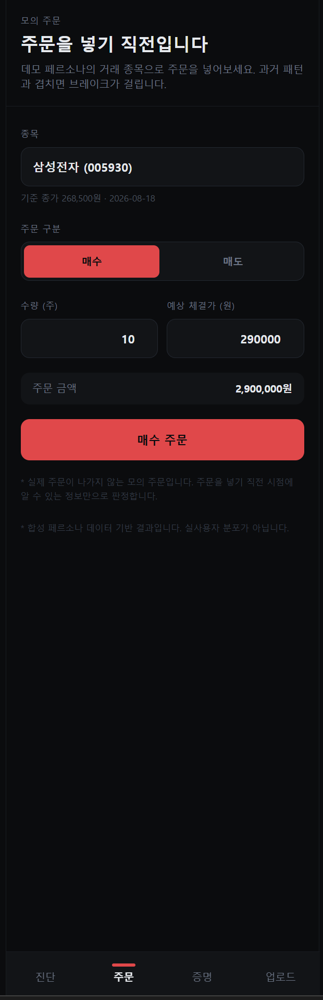

# 매매 브레이크 — 서비스 기획 및 기능 명세서

> 2026 금융 AI Challenge 출품작 · 제출: 2026-09-07 10:00

- 서비스 URL: https://brakefit.vercel.app
- API 문서: https://brakefit.onrender.com/docs
- 소스 코드: https://github.com/durinnn/brakefit
- 팀: 지종우(리더, 데이터 계약·포지션 엔진·웹·배포) · 최성범(파서·합성 데이터) · 강준일(편향 지표·브레이크 룰·가드레일) · 임승규(백테스트·API)

---

## 1. 요약

개인투자자의 손실은 정보가 부족해서 생기기보다, 같은 판단 습관이 반복돼서 생긴다. 오른 종목은 서둘러 팔고 내린 종목은 버티며, 물린 종목에 돈을 더 넣고, 이미 급등한 종목을 뒤늦게 따라 산다. 이 세 가지는 행동재무학이 오래전부터 기술해 온 편향이지만, 정작 투자자 본인은 자신의 거래내역에서 그것을 숫자로 확인한 적이 없다. 진단이 없으니 교정도 없고, 같은 실수가 계좌 단위로 되풀이된다.

매매 브레이크는 증권사에서 내려받은 거래내역 파일 하나로 이 세 가지 편향을 0~100 점으로 수치화하고, 같은 패턴의 주문을 넣으려는 바로 그 순간에 화면을 멈춰 세운다. 개입의 근거는 시장 통념이나 일반론이 아니라 그 사람 자신의 과거 거래다. 그리고 "그때 멈췄다면 손익이 어떻게 달라졌을지"를 반사실 백테스트로 계산해, 유리하지 않은 결과까지 그대로 보여준다.

**핵심 가치**

| | 가치 | 내용 |
|---|---|---|
| ① | 개인 실증 기반 개입 | 경고 문구의 근거가 전역 가중치가 아니라 사용자 본인의 과거 거래 통계다. "왜 나에게 이 경고가 뜨는가"에 데이터로 답한다. |
| ② | 화이트박스 | 판단 경로에 생성형 AI가 없다. 점수·판정·검증은 전부 결정론적 규칙이며, 언어모델은 이미 내려진 판정을 사람의 말로 옮기는 설명 문구에만 쓰고 그 출력마저 사후 검증을 통과해야 채택된다. |
| ③ | 정직한 검증 | 개입의 효과를 반사실로 계산하는 기능을 서비스 안에 내장했다. 검증 구간에서 개입이 순손실로 나온 결과를 감추지 않고 그대로 화면에 띄운다. |

**데모 흐름**: 거래내역 업로드에서 진단 리포트, 모의 주문창의 브레이크 팝업, 반사실 백테스트 결과까지 90초 안에 이어진다.

**링크**: 서비스 https://brakefit.vercel.app · API 문서 https://brakefit.onrender.com/docs · 소스 코드 https://github.com/durinnn/brakefit

## 2. 문제 정의와 배경

### 2.1 개인투자자가 반복하는 세 가지 실수

**처분효과.** 오른 종목은 서둘러 이익을 확정하고, 내린 종목은 손실을 확정하기 싫어 계속 들고 있는 경향이다. Odean(1998)이 개인 계좌 자료로 실현이익 비율과 실현손실 비율의 차이를 측정해 처음 체계적으로 보인 현상이다. 결과적으로 계좌에는 오래 물린 종목만 남고, 이익은 짧게 끊긴다.

**물타기.** 이미 평가손실 상태인 종목에 추가매수해 평균단가를 낮추는 행동이다. 판단이 틀렸다는 사실을 인정하지 않기 위해 같은 종목에 자금을 더 넣는 쪽으로 기울면, 한 종목에 노출이 집중되고 회복 국면이 오지 않을 때 손실 규모가 비선형으로 커진다.

**추격매수.** 이미 크게 오른 종목을 더 오를 것이라 기대하고 뒤늦게 따라 사는 행동이다. 급등 뉴스와 커뮤니티 반응이 매수 근거를 대신하며, 진입 가격이 높아 되돌림 구간에서 곧바로 평가손실 상태가 된다.

세 가지 모두 개별 거래로 보면 합리적인 이유가 붙는다. 문제는 같은 유형의 판단이 한 사람의 계좌에서 반복된다는 점이고, 반복은 거래내역이라는 기록에 남는다.

### 2.2 왜 지금인가

모바일 거래 환경이 보편화되면서 20~30대의 직접 주식투자 진입 장벽이 사실상 사라졌다. 계좌 개설부터 첫 주문까지 몇 분이면 끝나고, 소수점 매매와 신용·미수 기능도 같은 화면 안에 있다. 진입은 쉬워졌지만 판단을 점검할 장치는 그만큼 늘지 않았다.

문제는 손실이 투자 영역에서 끝나지 않는다는 데 있다. 차입을 동반한 투자에서 발생한 손실은 청년층의 부채로 이어지고, 부채는 다시 회복을 위한 무리한 매매를 부른다. 이 고리를 끊는 개입은 사후 상담이 아니라 주문이 실행되기 전에 이루어져야 한다.

금융당국 역시 AI 활용에서 설명가능성과 책임성을 강조하는 방향으로 기준을 정리해 왔다. 투자자에게 무엇을 사라고 말하는 서비스보다, 투자자 자신의 판단 습관을 근거와 함께 되짚어 주는 서비스가 규제 환경과 더 잘 맞는다.

### 2.3 기존 서비스의 공백

시중 서비스는 대체로 정보 제공과 종목 추천에 무게가 실려 있다. 일부 증권사는 투자패턴 분석 화면을 이미 제공하지만, 대부분 과거 성향을 보여주는 진단에서 끝난다. 주문 직전에 개입하는 기능, 그리고 그 개입이 실제로 얼마의 가치가 있었는지 사후에 계산해 보여주는 기능은 비어 있다.

| 서비스 유형 | 진단 | 주문 직전 개입 | 효과 검증 | 근거의 개인화 |
|---|---|---|---|---|
| 종목 추천·AI 리서치 | 없음 | 없음 | 없음 | 시장 데이터 기반 |
| 증권사 투자패턴 분석 화면 | 있음 | 없음 | 없음 | 본인 거래 기반 |
| 자산관리·가계부 앱 | 자산 현황 중심 | 없음 | 없음 | 본인 자산 기반 |
| 매매 브레이크 | 있음 | 있음 | 있음 | 본인 거래 기반 |

## 3. 서비스 컨셉

### 3.1 한 줄 정의

거래내역으로 개인의 행동 편향을 수치화하고, 같은 실수를 반복하기 직전에 개입하며, 그 개입의 효과를 본인의 데이터로 계산해 보여주는 소비자보호형 웹서비스.

### 3.2 진단 · 개입 · 증명

| 단계 | 사용자가 보는 것 | 서비스가 하는 일 |
|---|---|---|
| ① 진단 | 편향 3종의 점수·등급·백분위와 근거 사례 | 거래내역과 일봉으로 일별 포지션을 재구성하고, 편향별 점수를 계산한다 |
| ② 개입 | 주문 직전의 위험 게이지, 기여도 분해, 과거 패턴 경고 | 주문 시점까지의 정보만으로 브레이크 룰을 판정하고, 본인의 과거 편향 점수에 비례한 위험 기여를 산출한다 |
| ③ 증명 | 회피한 손실과 놓친 이익, 그 차이인 순효과 | 브레이크가 걸렸을 과거 매수를 반사실로 제거하고 이후 실제 가격으로 손익을 다시 계산한다 |

### 3.3 설계 원칙

**① 근거는 본인의 과거 거래다.** 위험 점수의 크기는 그 사람의 과거 편향 점수에 비례한다. 같은 주문이라도 추격매수 이력이 없는 사용자에게는 낮은 점수가, 반복된 사용자에게는 높은 점수가 나온다. 가중치의 타당성을 일반론으로 방어하지 않고 개인 실증에 결속시킨 설계다.

**② 화이트박스다.** 파서, 포지션 엔진, 편향 지표, 브레이크 룰, 백테스트로 이어지는 판단 경로 전체가 결정론적 규칙이다. 언어모델은 이미 확정된 판정을 사람의 문장으로 옮기는 자리에만 붙고, 그 출력은 숫자 화이트리스트와 금지어 필터를 통과해야 채택된다. 통과하지 못하면 고정 템플릿으로 대체된다. 문구가 바뀌어도 판정 결과는 바뀌지 않는다.

**③ 미래 정보를 참조하지 않는다.** 브레이크 판정과 백테스트의 개입 재현은 주문 시점에 알 수 있는 정보만 사용한다. 사후 가격은 오직 결과를 평가할 때만 쓴다. 이 경계는 시세 조회 지점 한 곳으로 모아 두었고, 회귀 테스트로 고정했다.

**④ 검증은 정직하게 한다.** 개입의 효과를 반사실로 계산하는 기능을 서비스에 내장하고, 결과가 불리하게 나와도 유리한 기간을 골라 다시 돌리지 않는다. 현재 검증 구간에서 개입은 순손실이며, 그 사실을 그대로 표시한다(§7).

**⑤ 규제를 준수하고 중립을 지킨다.** 데이터 확보 경로는 사용자가 직접 내려받은 파일의 업로드 하나뿐이다. 마이데이터 연동은 별도 인가가 필요한 영역이므로 어댑터 인터페이스만 남겨 두고 로드맵으로 미뤘다. 어떤 화면에서도 특정 상품이나 종목을 권유하지 않으며, 개입 문구에서 추천·목표가·전망 표현은 필터로 차단한다.

이 다섯 가지는 금융당국이 AI 활용에서 요구하는 설명가능성과 책임성을 기능 수준으로 옮긴 것이다. 사용자는 자신이 받은 경고가 어떤 규칙에서 나왔는지, 그 규칙의 강도가 자신의 어떤 과거 거래에서 왔는지를 화면에서 직접 확인할 수 있고, 서비스는 그 판단에 대해 사후 검증 결과까지 함께 공개한다.

## 4. 사용자 시나리오

### 4.1 타깃 사용자

모바일 거래 앱으로 국내 주식을 직접 매매하는 20~30대 개인투자자다. 투자 경력이 길지 않고, 매매 판단의 근거가 뉴스·커뮤니티·직전 수익률에 크게 의존하며, 자신의 거래 습관을 통계로 본 적이 없는 사용자를 상정한다. 해외주식, 파생상품, 실시간 시세, 실제 주문 연동은 이번 범위 밖이다.

### 4.2 대표 시나리오

20대 후반 직장인 A는 급등 종목을 뒤늦게 따라 사는 습관이 있다. 오르는 종목을 보면 더 오를 것 같아 일단 사고, 며칠 뒤 되돌림이 오면 평단을 낮추려 한 번 더 산다. 계좌 잔고는 알지만 자신이 어떤 상황에서 매수 버튼을 누르는지는 모른다. A는 증권사 앱에서 거래내역을 내려받아 매매 브레이크에 올린다. 잠시 뒤 화면에 세 개의 점수가 뜬다. 추격매수 점수가 가장 높고, 같은 조건으로 만든 비교 표본 기준으로 상위 5%에 해당한다는 표시가 붙는다. 아래에는 근거가 된 실제 매수 건들이 급등률과 함께 나열돼 있다. 며칠 뒤 A는 다시 급등한 종목을 보고 모의 주문창에 매수 주문을 넣는다. 주문 버튼을 누르는 순간 화면이 멈추고, 기준 종가 대비 8% 높은 가격이라는 사실과 함께 "과거에 같은 방식으로 매수한 사례가 14건 있었다"는 경고가 뜬다. 위험 점수가 어떤 편향에서 얼마씩 왔는지도 함께 표시된다. A는 주문을 멈추고 백테스트 화면으로 넘어가, 자신의 습관이 지난 기간 동안 금액으로 얼마였는지를 확인한다.

### 4.3 90초 데모 순서

1. 첫 화면에서 데모 페르소나로 바로 진입하거나, 거래내역 파일을 업로드한다.
2. 진단 대시보드에서 종합 점수와 등급, 편향 3종의 점수·백분위·근거를 확인한다.
3. 모의 주문창으로 이동해 종목·수량·가격을 넣고 매수 주문을 넣는다.
4. 브레이크 팝업이 뜬다. 기준 종가 대비 등락률, 위험 게이지, 기여도 분해, 과거 패턴 경고, 대안 제안을 확인한다.
5. "멈추기"를 누른 뒤 백테스트 화면으로 이동한다.
6. 회피한 손실과 놓친 이익, 그 차이인 순효과와 개입 적중률을 확인한다.

### 4.4 전체 흐름

화면 전환, 상태 처리, 요청 단위 데이터 흐름은 [부록 D](user-flow.md)의 흐름도에 정리했다.

## 5. 화면 및 기능 명세

### 5.0 기능 목록

| | 기능 | 화면 | 상태 |
|---|---|---|---|
| F1 | 거래내역 업로드 — 표준 CSV와 증권사 화면 3종 자동 인식 | 업로드 | 완료 |
| F2 | 편향 진단 리포트 — 종합 점수·등급, 지표 3종 점수·백분위·근거 | 진단 대시보드 | 완료 |
| F3 | 모의 주문 개입 — 브레이크 룰 판정, 위험 게이지, 기여도 분해, 경고 문구 | 모의 주문창 | 완료 |
| F4 | 반사실 백테스트 — 회피한 손실, 놓친 이익, 순효과, 적중률 | 백테스트 결과 | 완료 |
| F5 | 합성 페르소나 데모 모드 — 업로드 없이 전 화면 체험 | 전 화면 | 완료 |
| F6 | 데이터 품질 경고 — 보유수량 초과 매도, 종목코드 미해결 등 | 진단 대시보드 배너 | 완료 |

> 스크린샷은 2026-09-07 프로덕션 화면, 데모 페르소나(추격매수형) 기준.

### 5.1 거래내역 업로드




사용자가 증권사에서 내려받은 거래내역 파일을 올려, 데모 페르소나 대신 자신의 데이터로 진단을 받는 화면이다. 업로드가 끝나면 무엇이 몇 건 읽혔고 무엇이 빠졌는지를 먼저 보여준다.

**표시 정보**

- 파일 선택 영역. 파일을 고르면 파일명과 용량으로 바뀐다.
- 안내문 — 국내 주식 체결 내역만 분석한다는 점, 증권사 파일에 종목코드가 없으면 종목명으로 코드를 찾는다는 점, 업로드하지 않아도 데모 페르소나로 모든 화면을 볼 수 있다는 점.
- 업로드 결과 카드 — 읽어들인 거래 건수와 기간, 인식된 형식(증권사 거래내역 또는 표준 CSV), 제외된 행 수.
- 확인이 필요한 항목 목록 — 데이터 품질 경고가 있을 때만 노출한다.

**사용자 행동**

- 파일을 선택하고 "업로드하고 진단하기"를 누른다. 파일을 고르기 전에는 버튼이 비활성 상태다.
- "진단 보기"로 진단 대시보드로 이동한다.
- "다른 파일 올리기"로 같은 화면에서 다시 시도한다.

**예외 처리**

- 처리 중에는 버튼 문구가 "분석 중…"으로 바뀌고 버튼이 잠긴다.
- 파일 형식이 맞지 않거나 용량 상한을 넘으면 실패 사유를 한국어 문장으로 보여준다.
- 업로드에 성공하면 세션 식별자를 쿠키에 저장한다. 유효기간은 7일이지만 서버 세션이 먼저 사라질 수 있으며, 그 경우의 동작은 5.2에 정리했다.

> 위 업로드 완료 화면은 샘플 CSV 업로드 기준.

### 5.2 진단 대시보드




사용자의 매매 습관을 한 화면에 요약하는 진단 리포트다. 종합 점수로 전체 강도를, 지표 3종으로 어떤 편향이 두드러지는지를 보여준다.

**표시 정보**

- 데이터 출처 배지 — "데모 페르소나" 또는 "내 거래내역 · N건". 반대편으로 전환하는 링크가 함께 있다.
- 데이터 품질 경고 배너 — 보유수량을 초과한 매도 기록, 종목코드 미해결 등 분석에 영향을 주는 항목이 있을 때만 노출한다.
- 종합 편향 게이지(0~100)와 등급(안정 · 주의 · 위험).
- 지표 3종 카드 — 점수, 진행바, 백분위 표기, 근거 사례 건수, 근거 한 줄 요약.
- 백테스트 화면으로 넘어가는 안내 문구.
- 합성 데이터 각주 — 데모 페르소나를 보고 있을 때만 표시한다.

**사용자 행동**

- 배지의 링크로 데모와 내 거래내역을 오간다.
- 안내 문구를 눌러 백테스트 화면으로 이동한다.
- 하단 탭으로 다른 화면으로 이동한다.

**예외 처리**

- 서버 응답을 기다리는 동안에는 빈 화면 대신 카드 골격을 먼저 그린다. 무료 플랜 서버의 최초 응답이 길어질 수 있어 의도적으로 둔 장치다.
- 서버 연결에 실패하면 한국어 안내와 함께 "다시 시도" 및 "홈으로" 버튼을 보여준다.
- 업로드 세션이 만료된 경우 데모 페르소나로 자동 전환하고, 배지에 "(업로드 세션 만료됨)"을 붙인 뒤 만료된 쿠키를 정리한다.
- 분석 가능한 거래가 한 건도 없으면 점수 대신 "분석 불가" 안내 카드와 사유 배너를 보여준다.

> 위 데이터 품질 경고 화면은 샘플 CSV 업로드 기준.

### 5.3 모의 주문창




실제 주문 화면을 본뜬 모의 주문창이다. 사용자가 주문을 넣으면 그 주문이 본인의 과거 편향 패턴과 겹치는지 판정하고, 겹치면 화면을 멈춰 세운다.

**표시 정보 — 주문 입력**

- 종목 선택 목록. 사용자의 거래내역에 있는 종목만 나오며, 고르면 기준 종가가 예상 체결가 기본값으로 들어간다.
- 매수·매도 선택, 수량, 가격, 총액.
- 주문 실행 버튼.

**표시 정보 — 브레이크 팝업**

- 주문 요약 — 종목명과 코드, 기준 종가 대비 등락률, 수량·단가·총액. 화면에 뜨는 기준 종가는 판정에 쓴 값과 같은 값이다.
- 위험 게이지(0~100)와 등급(낮음 · 주의 · 매우 위험). 개입이 발생한 상태에서는 등급을 최소 "주의"로 표시한다. 경고 팝업과 게이지가 서로 반대되는 인상을 주지 않도록 표시 등급에만 적용하는 보정이며, 점수와 판정 자체는 규칙이 낸 값 그대로다.
- 기여도 분해 — 기준 위험도에서 시작해 추격매수·물타기·처분효과가 각각 얼마를 더했는지와 최종 위험 점수, 항목별 근거 문구.
- 과거 패턴 경고 — 헤드라인, 유사 사례 건수, 지배 편향에 따른 평균값(추격매수는 매수 시점 평균 급등률, 물타기는 매수 시점 평균 평가손익률, 처분효과는 사례 평균 손익률), 설명 문장.
- 대안 제안 목록과 "멈추기" · "경고를 무시하고 주문 진행" 버튼.

예를 들어 기준 종가가 268,500원(2026-08-18)인 종목에 290,000원으로 10주 매수 주문을 넣으면, 기준 종가 대비 8.01% 높은 가격이므로 추격매수 규칙이 발동하고 팝업이 뜬다.

**사용자 행동**

- 종목·매수매도·수량·가격을 입력하고 주문 버튼을 누른다.
- 개입이 발생하면 "멈추기"를 눌러 주문을 중단하거나, "경고를 무시하고 주문 진행"을 눌러 2단계 확인을 거쳐 진행한다.
- 개입이 아니면 팝업 없이 통과 안내를 보여준다.

**예외 처리**

- 응답 대기 중에는 버튼 문구가 "판정 중…"으로 바뀐다.
- 기준 종가를 구하지 못하는 종목은 예상 체결가를 직접 입력하도록 안내한다.
- 판정에 실패하면 사유를 문장으로 보여준다.
- 세션 만료 시 데모 페르소나로 전환되는 동작은 진단 대시보드와 같다. 다만 이 화면에는 데이터 출처 배지가 없어 전환 사실이 표시되지 않는다(§10).
- 멈추기와 진행 선택은 이번 화면 안의 기록이며 서버에 남지 않는다. 화면 문구도 그 범위로만 안내한다.

### 5.4 백테스트 결과


브레이크를 따랐다면 손익이 어떻게 달라졌을지를 금액으로 보여주는 화면이다. 개입의 효과를 주장이 아니라 계산 결과로 제시한다.

**표시 정보**

- 분석 기간과 개입 대상 건수.
- 순효과 카드 — 금액과 비율. 양수와 음수를 색으로 구분한다.
- 개입 건수와 개입 적중률.
- 회피한 손실과 놓친 이익 막대 두 개, 그리고 "회피한 손실 − 놓친 이익 = 순효과" 계산식.
- 주요 개입 사례 목록 — 날짜, 종목명, 편향 종류, 금액 영향.
- 합성 데이터 각주 — 데모 페르소나를 보고 있을 때만 표시한다.

**사용자 행동**

- 스크롤로 사례 목록을 확인한다. 그 외 조작이 없는 읽기 전용 화면이다.

**예외 처리**

- 로딩과 오류 처리는 다른 화면과 같다.
- 개입 대상 거래가 없으면 "증명할 개입 사례가 없습니다" 안내를 보여준다.
- 세션 만료 시 동작은 진단 대시보드와 같다.

## 6. 핵심 알고리즘

### 6.1 포지션 재구성 엔진

거래내역만으로는 "그 매수를 넣던 날 그 종목이 얼마나 물려 있었는지"를 알 수 없다. 그래서 모든 분석에 앞서 거래내역과 일봉 시세를 합쳐 일별 포지션 이력을 다시 만든다. 출력은 (일자, 종목) 단위이며 보유수량, 평균단가, 종가, 평가손익과 평가손익률, 그날의 실현손익, 보유 경과일을 담는다.

- **보유 구간 분리.** 보유수량이 0에서 양수가 되는 시점을 진입, 다시 0이 되는 시점을 청산으로 보고 그 사이를 하나의 보유 구간으로 묶는다. 전량 청산 후 재진입하면 별개의 구간이다. 지표는 이 구간 단위로 "진입 매수"와 "추가매수"를 구분한다.
- **평균단가는 매수금액 기준.** 매입 가중 이동평균으로 계산하고, 매도 시점에는 평균단가를 바꾸지 않는다.
- **종가가 없는 날.** 거래정지 등으로 종가가 비면 직전 종가를 이어 쓰고 그 사실을 경고로 남긴다.
- **수수료와 세금의 미제공과 0원을 구분한다.** 증권사 화면에 따라 수수료 항목이 아예 없는 경우가 있는데, 이때 값을 0으로 채우면 실현손익이 조용히 과대 계산된다. 값이 없는 것과 실제로 0원인 것을 끝까지 다른 값으로 다루고, 값이 없으면 그 거래의 손익이 수수료 차감 전 금액임을 표시한다.

### 6.2 편향 지표 3종

세 지표 모두 0~100 점으로 정규화하며, 점수와 함께 그 점수의 근거가 된 실제 거래 목록을 돌려준다. 화면에 뜨는 모든 문장은 이 근거 목록의 숫자에서 나온다.

**처분효과**

- 정의: 오른 종목은 서둘러 팔고 내린 종목은 계속 버티는 경향.
- 잡는 방법: 청산된 보유 구간은 실현손익의 부호로, 아직 보유 중인 구간은 최신 평가손익의 부호로 이익 건과 손실 건을 나눈다. 별도 문턱을 두지 않고 부호만 본다. 문턱을 두면 그 구간의 손익 부호가 사실상 무작위에 가까워져 신호가 희석되기 때문이다.
- 산식: `PGR = 실현이익 건수 / (실현이익 건수 + 미실현이익 건수)`, `PLR = 실현손실 건수 / (실현손실 건수 + 미실현손실 건수)`, `점수 = (PGR − PLR + 1) / 2 × 100`
- 근거 사례: 가장 빨리 판 이익 실현 건 하나와 가장 오래 버틴 손실 건 하나. 예를 들어 "1일 만에 매도, 실현손익 190,081원(11.27%)".

**물타기**

- 정의: 이미 평가손실 상태인 종목에 추가매수하는 경향. 진입 매수 자체는 물타기가 아니므로 진입 이후의 추가매수만 센다.
- 잡는 방법: 각 매수 거래를 해당 종목의 보유 구간에 되맞춘 뒤, 진입일 매수를 제외하고, 매수 당일 평가손익이 음수였던 건만 센다.
- 산식: `점수 = 평가손실 상태 추가매수 건수 / 전체 매수 건수 × 100`
- 근거 사례: 평가손실 상태에서 추가매수한 건들. 예를 들어 "평가손실 −62,234원(−4.0%) 상태에서 2주 추가매수".

**추격매수**

- 정의: 이미 오른 종목을 더 오를 것으로 기대하고 뒤늦게 따라 사는 경향.
- 잡는 방법: 보유 중인 종목에 대한 추가매수 가운데, 전일 종가 대비 5% 이상 급등한 가격에 체결된 건을 센다.
- 산식: `점수 = 급등 후 매수 건수 / 전체 매수 건수 × 100`
- 판정 불가 매수의 처리: 비교할 전일 종가를 확보하지 못해 급등 여부를 판정할 수 없는 매수는 분모에는 남기되 분자에는 넣지 않는다. 즉 "추격 아님" 쪽으로 보수적으로 처리해 편향 점수를 과대평가하지 않는다.
- 근거 사례: 급등 후 매수한 건들. 급등률은 매수 시점 기준이며 그 이후의 실제 수익률이 아니다. 예를 들어 "전일 종가 대비 6.1% 급등 후 1주 매수".

세 지표의 분모는 모두 "그 사람의 전체 매수 건수"로 통일했다. 사용자가 읽는 문장이 "내 매수 중 몇 퍼센트가 이 패턴이었나"로 일관되게 유지되도록 한 선택이다.

### 6.3 종합 점수와 등급, 백분위

- **종합 점수**: 세 지표를 40(추격매수) · 35(물타기) · 25(처분효과)의 가중치로 합산한다. 브레이크 룰의 최대 기여도와 같은 값을 써서, 진단 화면의 점수 구성과 주문 화면의 위험 구성이 같은 비중을 갖게 했다.
- **등급**: 종합 점수 40 미만은 안정, 70 미만은 주의, 70 이상은 위험이다. 등급은 종합 점수에만 붙이고 개별 지표에는 붙이지 않는다.
- **분석 불가**: 분석 가능한 거래가 0건이면 점수를 만들지 않고 "분석 불가" 상태와 사유를 돌려준다. 근거 없는 숫자를 만들어 내지 않기 위한 처리다.
- **백분위**: 합성 페르소나 5종에 난수 시드 4개를 곱한 20개 표본을 기준선으로 삼는다. 기준선은 측정 대상과 완전히 같은 생성 조건으로 만든다. 조건이 다르면 비교 자체가 성립하지 않기 때문이다. 화면에는 "상위 N%"로 표기한다. 표본이 20개라 해상도는 5% 단위이며 참고 지표 이상으로 쓰지 않는다.

아래는 데모 유니버스 3종목 기준으로 합성 페르소나 5종의 추격매수 점수를 측정한 결과다. 각 페르소나가 의도한 순서대로 정렬되며, 대조군과 추격매수형의 점수 차이는 약 3.6배다.

| 페르소나 | 추격매수 점수 | 근거 사례 | 화면 표기 |
|---|---:|---:|---:|
| 처분효과형 | 0.00 | 0 | 상위 85% |
| 차분형(대조군) | 16.67 | 2 | 상위 50% |
| 물타기형 | 23.81 | 5 | 상위 35% |
| 복합형(데모 기본) | 30.43 | 7 | 상위 25% |
| 추격매수형 | 60.87 | 14 | 상위 5% |

> 합성 페르소나 결과이며 실사용자 분포가 아니다.

### 6.4 브레이크 룰

사용자가 주문을 넣으면 세 개의 규칙이 각각 발동 여부와 위험 기여를 계산한다. 판정에 쓰는 정보는 주문 시점까지의 데이터뿐이다.

| 룰 | 발동 조건 (주문 시점 정보만 사용) | 기여 점수 |
|---|---|---:|
| 추격매수 | 매수 주문이고, 주문가가 기준 종가 대비 5% 이상 높다. 보유 여부를 따지지 않는다 | `40 × (본인 추격매수 점수 / 100)` |
| 물타기 | 매수 주문이고, 해당 종목을 현재 보유 중이며 그 포지션이 평가손실 상태다 | `35 × (본인 물타기 점수 / 100)` |
| 처분효과 | 매도 주문이고, 해당 종목을 현재 보유 중이며 그 포지션이 평가이익 상태다 | `25 × (본인 처분효과 점수 / 100)` |

- **위험 점수**는 세 기여 점수의 합(0~100)이다. 세 규칙 모두 "과거 편향 점수가 높을수록 이번 주문의 위험 기여가 커진다"는 동일한 구조를 갖는다.
- **개입 조건**은 규칙이 하나라도 발동했거나 위험 점수가 50 이상인 경우다. 점수만으로 개입을 정하지 않는 이유는, 백테스트가 세는 개입 주문 집합과 화면에 팝업이 뜨는 주문 집합을 일치시키기 위해서다.
- **표시 등급**은 위험 점수 30 미만이 낮음, 50 미만이 주의, 50 이상이 매우 위험이다. 다만 개입이 발생한 경우에는 최소 "주의"로 올려 표시한다. 경고 팝업과 게이지가 서로 반대되는 인상을 주지 않게 하기 위한 표시 보정이며, 점수와 판정 자체는 바뀌지 않는다.
- **기준 종가**는 주문 시점 이하의 마지막 영업일 종가로 정의한다. 일별 포지션이 아니라 시세 캐시에서 직접 조회하며, 연휴 등으로 영업일이 없으면 최대 14일까지 거슬러 올라간다. 이 정의를 쓰는 이유는 두 가지다. 첫째, 보유 이력이 없는 종목도 판정할 수 있다. 추격매수의 전형적인 형태가 "갖고 있지 않던 종목이 급등하자 따라 사는 것"이므로, 보유 중인 종목만 판정하는 방식으로는 정작 잡아야 할 사례를 놓친다. 둘째, 규칙 판정과 화면 등락률, 주문 폼 기본가가 모두 같은 값을 보게 되어 화면 두 곳이 다른 숫자를 말하는 일이 없다.
- **미래 정보 차단 지점은 이 시세 조회 한 곳이다.** 조회 구간의 끝을 주문 시점으로 못 박아, 그보다 뒤 날짜의 종가는 판정 로직 안으로 들어올 수 없다. 시세 캐시 자체는 더 뒤 날짜까지 갖고 있으므로 이 경계가 곧 안전장치다.
- **시세를 구하지 못하면 발동하지 않는다.** 대신 그 사유를 경고로 남긴다. 발동하지 않았다는 사실만으로는 "급등이 아니었다"와 "판정하지 못했다"가 구분되지 않기 때문이다.

### 6.5 설명 문구 생성과 가드레일

브레이크가 걸린 뒤 사용자에게 보여줄 문장은 언어모델이 만든다. 다만 판정에는 관여하지 않는다.

- **생성**: Claude Haiku를 호출하고 타임아웃은 2.5초다. 시스템 프롬프트에서 근거 데이터에 있는 숫자만 사용할 것, 투자 추천·목표가·전망을 언급하지 말 것을 지시한다.
- **사후 검증**: 생성된 문장을 두 가지로 다시 검사한다. 첫째, 문장에 등장하는 모든 숫자가 근거 데이터 안에 실제로 존재해야 한다. 둘째, 금지어("추천", "매수하세요", "매도하세요", "목표가", "손절가", "적정가", "전망", "예상수익", "오를", "내릴")가 포함되면 안 된다.
- **폴백**: 두 검증 중 하나라도 실패하거나, 응답이 지연되거나, API 키가 없거나, 응답 형식이 깨지면 고정 템플릿 문구로 대체한다.
- **판정은 불변**: 문구가 생성문이든 템플릿이든 위험 점수와 개입 여부는 달라지지 않는다. 언어모델이 없거나 실패한 환경에서도 서비스의 판단은 동일하게 작동한다.

## 7. 효과 검증: 반사실 백테스트

### 7.1 방법

브레이크의 효과는 주장으로 증명할 수 없다. 그래서 과거 거래를 대상으로 "그때 브레이크가 있었다면"을 재현하는 반사실 계산을 서비스 안에 넣었다.

1. **개입 재현.** 과거 매수 거래 하나하나에 대해, 그 거래 이전에 체결된 거래만으로 포지션과 지표를 다시 만들고 그 시점의 브레이크 룰을 돌린다. 판정에 그 거래 이후의 정보는 전혀 쓰지 않는다.
2. **손익 평가.** 개입 대상으로 판정된 매수를 없었던 것으로 가정하고, 그 수량이 이후 실제로 어떤 가격이 되었는지로 손익을 계산한다. 가격이 떨어졌다면 그 매수를 막은 것이 손실을 회피한 것이고, 올랐다면 이익을 놓친 것이다. 이 평가 단계에서만 사후 가격을 쓴다.
3. **집계.** `순효과 = 회피한 손실 − 놓친 이익`. 순효과율은 해당 기간 총 매수금액 대비 비율이다. 적중률은 전체 개입 중 결과적으로 손실을 회피한 개입의 비율이다.

매수를 막는 규칙 2종(물타기·추격매수)만 대상으로 한다. 처분효과는 "팔지 말았어야 했다"의 반사실이 "그 물량을 언제까지 들고 있었을 것인가"라는 별도 가정을 요구하고, 그 가정이 결과를 좌우해 버려 이번 범위에서 제외했다.

### 7.2 결과

| 페르소나 | 기간 | 개입 건수 | 회피한 손실 | 놓친 이익 | 순효과 | 순효과율 | 적중률 |
|---|---|---:|---:|---:|---:|---:|---:|
| 차분형(대조군) | 2026.03.13~08.13 | 5 | 24,000 | 876,000 | −852,000 | −5.52% | 20.0% |
| 처분효과형 | 2026.02.19~08.14 | 5 | 144,000 | 221,000 | −77,000 | −0.49% | 40.0% |
| 물타기형 | 2026.02.05~08.13 | 14 | 124,500 | 1,282,000 | −1,157,500 | −5.87% | 21.4% |
| 추격매수형 | 2026.04.01~08.13 | 18 | 1,096,000 | 3,205,500 | −2,109,500 | −6.84% | 22.2% |
| 복합형(데모 기본) | 2025.12.04~08.18 | 12 | 7,000 | 552,700 | −545,700 | −2.93% | 16.7% |

> 금액 단위는 원. 순효과 = 회피한 손실 − 놓친 이익. 순효과율은 해당 기간 총 매수금액 대비다.

### 7.3 해석

**검증 구간에서는 개입이 순손실이다.** 다섯 페르소나 모두 순효과가 음수로 나왔다.

이 결과를 감추거나 유리한 기간을 골라 다시 계산하지 않는다. 편향 차단이 항상 수익을 만드는 것은 아니라는 결과를 그대로 보여주는 것이 이 기능의 목적이기 때문이다. 서비스가 제공하는 것은 "브레이크를 걸면 돈을 번다"는 약속이 아니라 "당신의 편향이 실제로 얼마짜리였는지 본인 데이터로 계산해 준다"는 도구이며, 이 음수는 그 계산기가 정직하게 작동한다는 증거다.

원인은 구조적이다. 물타기와 추격매수 규칙은 매수를 막는 방향으로 작동한다. 시장이 전반적으로 오르는 국면에서는 "막았더라도 어차피 올랐을" 확률이 높아 놓친 이익이 회피한 손실보다 커진다. 즉 이 표의 음수는 브레이크 로직의 결함이 아니라 결과가 시장 국면에 의존한다는 사실을 보여준다.

> **(a) 기간 의존성.** 검증 구간은 서비스에 동봉한 시세 캐시가 덮는 2025.11.03~2026.09.03이며, 페르소나별 거래 기간은 그 안의 부분 구간이다. 이 구간은 국내 증시가 대체로 상승한 국면이다. 하락장과 횡보장 구간을 추가로 검증하지 않는 한, 이 수치를 "브레이크가 도움이 된다" 또는 "되지 않는다"의 일반적 근거로 제시해서는 안 된다.
>
> **(b) 합성 페르소나 결과이며 실사용자 분포가 아니다.** 거래는 몬테카를로 방식으로 생성했고 시세만 실제 데이터다. 페르소나의 생성 파라미터가 곧 편향의 세기이므로, 실제 개인투자자 모집단에서 같은 크기의 효과가 나온다는 뜻이 아니다.
>
> **(c) 처분효과는 포함되지 않았다.** 이번 백테스트의 대상은 매수를 막는 규칙 2종뿐이다. 따라서 처분효과형 페르소나의 −77,000원도 그 페르소나가 부수적으로 낸 매수 편향만 잡은 값이다.

### 7.4 이 결과가 서비스에 주는 의미

첫째, 이 기능은 수익률 개선을 약속하는 마케팅 장치가 아니라 사용자의 편향에 가격표를 붙여 주는 계산기다. 자신의 물타기 습관이 지난 반년 동안 금액으로 얼마였는지를 본인의 거래로 확인하는 경험 자체가 진단·개입의 설득력을 만든다.

둘째, 결과가 불리해도 그대로 표시한다는 원칙은 이 서비스가 특정 행동을 팔지 않는다는 사실의 실증이다. 사용자는 화면에 뜨는 숫자가 서비스에 유리하게 선택된 값이 아니라는 것을 결과 자체로 확인할 수 있다.

셋째, 남은 과제는 명확하다. 시장 국면별로 검증 구간을 넓히고, 처분효과의 반사실 정의를 확정하는 것이 다음 단계다(§10).

## 8. 시스템 아키텍처

### 8.1 구성 요소

| 구성 요소 | 책임 | 입력 | 출력 |
|---|---|---|---|
| 웹 UI | 화면 4개 렌더 — 업로드, 진단, 모의 주문, 백테스트 | API 응답 | 사용자 화면 |
| API 서버 | 파이프라인 오케스트레이션, 세션 관리, 결과 캐시 | 화면 요청, 업로드 파일 | 화면용 JSON 응답 |
| 파서 | 증권사 화면 파일과 표준 CSV를 표준 거래내역으로 변환, 제외 행 사유 기록 | 원본 파일 | 표준 거래내역, 검증 리포트 |
| 포지션 엔진 | 거래 재생으로 일별 포지션과 보유 구간 생성 | 표준 거래내역, 일봉 시세 | 일별 포지션, 보유 구간 |
| 지표·룰 | 편향 점수 3종과 근거 사례, 주문 개입 판정 | 일별 포지션, 보유 구간, 주문 | 점수·근거, 개입 여부·기여 점수 |
| 백테스트 | 반사실 재현으로 회피 손실과 놓친 이익 계산 | 표준 거래내역, 룰, 일봉 시세 | 순효과, 적중률, 사례 목록 |
| LLM 가드레일 | 근거 데이터를 문장으로 변환, 숫자·금지어 검증, 실패 시 템플릿 폴백 | 근거 데이터 | 헤드라인, 본문 |

### 8.2 기술 스택

| 계층 | 사용 기술 | 선택 이유 |
|---|---|---|
| 프론트엔드 | Next.js 15, Tailwind CSS | 서버 렌더링으로 초기 화면을 빠르게 띄우고, 모바일 폭 기준 화면을 단순한 구성으로 유지 |
| 백엔드 | FastAPI, pandas | 스키마 기반 응답 검증과 자동 API 문서, 거래 재생에 필요한 표 연산 |
| 시세 | pykrx 일봉, 파일 캐시 | 외부 네트워크 없이도 데모가 동작하도록 조회 결과를 저장소에 동봉 |
| 설명 문구 | Claude Haiku | 짧은 문장 생성에 충분한 응답 속도, 실패 시 템플릿 폴백 |
| 배포 | Vercel(프론트), Render(API) | 무료 구간에서 상시 접근 가능한 URL 확보 |

### 8.3 배포 구성

- 프론트엔드는 Vercel 싱가포르 리전, API 서버는 Render 싱가포르 리전에 배포한다. 두 서비스 간 왕복 거리를 줄이기 위한 배치다.
- 양쪽 모두 같은 브랜치를 배포 대상으로 삼는다. 화면과 API가 서로 다른 코드를 보면 응답 형태가 어긋나기 때문이다.
- 상태 점검 엔드포인트를 두고, 외부 크론이 5분 간격으로 호출한다. 무료 플랜 인스턴스는 일정 시간 요청이 없으면 절전 상태로 들어가는데, 데모 도중 최초 요청이 그 대기를 떠안는 것을 막기 위한 조치다.
- 서버 기동 시 백분위 기준선과 데모 페르소나의 진단·백테스트 결과를 미리 계산해 둔다. 백테스트는 최초 계산에 십수 초가 걸리므로, 이 비용을 사용자 요청이 아니라 기동 시점으로 옮겼다. 프리워밍이 실패해도 서버는 정상 기동하며 백분위는 기본값으로 대체된다.
- 페르소나별·세션별 결과를 프로세스 메모리에 캐시한다. 세션이 정리되면 해당 캐시도 함께 버린다.

### 8.4 데이터와 개인정보

- **업로드 파일은 디스크에 저장하지 않는다.** 파싱한 거래내역은 서버 메모리의 세션에만 두며, 세션은 최대 50개까지 유지하고 오래된 것부터 정리한다. 서버가 재시작되면 세션은 사라진다. 다시 보기가 불가능해지는 대신 사용자의 거래 기록이 서버에 남지 않는다.
- 세션 식별자는 브라우저 쿠키에 7일간 저장한다. 업로드 용량 상한은 5MB다.
- **시세는 외부 네트워크 없이 동작한다.** 데모 유니버스 8종목의 2025.11.03~2026.09.03 일봉을 저장소에 동봉했다. 거래소 조회가 막힌 환경에서도 데모 화면 전체가 응답한다.
- **원본 거래내역 파일에는 계좌번호와 계좌명이 평문으로 들어 있다.** 이 파일을 저장소에 넣지 않는 것을 개발 규칙으로 두었고, 테스트에 쓰는 값은 전부 지어낸 데이터다. 구조 확인이 필요할 때는 마스킹 사본을 만드는 도구를 사용한다.

### 8.5 입력 형식

- 표준 거래내역 CSV를 기본 형식으로 삼는다(부록 B). 컬럼 정의는 별도 데이터 계약 문서가 유일한 기준이며, 형태를 바꾸려면 코드가 아니라 문서를 먼저 고친다.
- 증권사 화면 파일 3종을 자동으로 인식해 표준 형식으로 변환한다. 형식이 다른 화면이나 다른 증권사를 지원하려면 매핑 정의 파일 하나를 추가하면 되고, 파서 코드는 건드리지 않는다.
- 파서가 어떤 행을 버릴 때는 반드시 사유를 남기고, 그 사유가 업로드 화면과 진단 화면의 경고로 올라온다. 조용히 사라지는 데이터를 만들지 않기 위한 규칙이다.

### 8.6 품질 관리

- 자동 테스트 222개가 모두 통과한다(2026-09-07 기준).
- 포지션 엔진, 편향 지표, 백테스트는 손으로 검산한 기대 정답표와 대조하는 테스트를 갖는다. 로직을 코드로 옮기기 전에 채점표를 먼저 만든다는 원칙이다.
- 미래 정보 참조를 막는 회귀 테스트를 별도로 둔다. 시세 조회 경계가 무너지면 테스트가 먼저 실패한다.
- 파서 매핑을 추가할 때는 손으로 검산 가능한 크기(10~15건)의 테스트 데이터와 테스트를 함께 낸다.

## 9. 차별점과 기대효과

### 9.1 유사 서비스 대비

| 비교 축 | 일반적인 AI 투자 서비스 | 매매 브레이크 |
|---|---|---|
| 데이터 출처 | 시장 데이터, 종목 재무 | 사용자 본인의 체결 내역 |
| 산출물 | 종목 추천, 시황 요약 | 본인의 판단 습관 점수와 근거 사례 |
| 개입 시점 | 없음 또는 사후 리포트 | 주문 실행 직전 |
| 판단 방식 | 모델 출력을 그대로 제시 | 결정론적 규칙, 언어모델은 설명 문구 전용 |
| 효과 검증 | 수익률 예시 | 반사실 백테스트를 서비스에 내장, 불리한 결과 포함 공개 |
| 규제 적합성 | 상품 권유 요소 존재 | 권유 없음, 추천·목표가·전망 표현을 필터로 차단 |

### 9.2 사회적 가치

이 서비스는 수익을 늘리는 도구가 아니라 손실의 반복을 줄이는 도구다. 특히 투자 경험이 짧은 청년층에게, 자신의 매매 기록이 통계로 무엇을 말하는지를 처음으로 보여준다. 개입 시점을 주문 직전으로 잡은 이유도 여기에 있다. 손실이 확정된 뒤의 상담은 이미 늦고, 차입을 동반한 손실은 회복을 위한 무리한 매매를 다시 부르기 때문이다. 어떤 화면에서도 상품이나 종목을 권유하지 않으므로, 소비자보호 목적과 서비스의 수익 동기가 충돌하지 않는다.

### 9.3 금융회사 관점의 활용

- **주문 화면 플러그인.** 브레이크 판정은 주문 정보와 그 사용자의 과거 체결 내역만 있으면 동작한다. 증권사 거래 앱의 주문 확인 단계에 얹으면 별도 화면 이동 없이 개입이 가능하다.
- **마이데이터 연동 시 업로드 불필요.** 데이터 입력 경로를 어댑터 인터페이스로 분리해 두었다. 인가 사업자가 연동하면 파일 업로드 단계 없이 같은 파이프라인이 동작하고, 엔진 이후는 전혀 바뀌지 않는다.
- **불완전판매 리스크가 없는 안내.** 상품 권유가 구조적으로 불가능한 설계이므로, 금융회사가 고객 보호 지표를 개선하는 용도로 도입할 때 판매 규제와 충돌하지 않는다.

### 9.4 확장성

증권사 화면 하나를 추가하는 비용은 매핑 정의 파일 하나와 테스트 한 벌이다. 파서 이후의 모든 모듈은 표준 거래내역만 보기 때문에 원본 형식을 알지 못하며, 따라서 증권사가 늘어나도 지표·룰·백테스트는 그대로다. 지표를 추가하는 경우도 동일하다. 점수와 근거 사례를 돌려주는 같은 형태를 따르면 진단 화면과 브레이크 룰에 함께 편입된다.

## 10. 한계와 로드맵

### 10.1 현재 한계

**데이터와 범위**

- 국내 주식 전용이며, 자동 인식하는 증권사 화면은 3종이다. 해외 주식은 국내 종목코드가 없고 통화가 달라 분석 파이프라인에 태우지 못한다.
- 증권사 화면 파일에는 종목코드 열이 없어 종목명으로 코드를 조회한다. 조회가 막힌 환경이거나 동봉한 시세 캐시 밖 종목이면 해당 거래가 제외되고, 전부 제외되면 "분석 불가"로 표시된다. 종목코드 열이 있는 표준 CSV에는 이 문제가 없다.
- 실사용자 데이터로 검증하지 않았다. 본 문서의 모든 수치는 합성 페르소나 기준이며 실제 개인투자자의 분포가 아니다.
- 업로드한 거래내역은 서버 메모리에만 있어 재시작이나 세션 정리 시 사라진다. 개인정보를 남기지 않기 위한 선택이지만, 그 대가로 "어제 올린 내역 다시 보기"가 불가능하다.

**분석 방법**

- 백테스트 결과가 검증 기간에 의존한다. 현재 구간은 상승 국면이라 매수를 막는 규칙이 구조적으로 불리하다(§7).
- 처분효과에 대한 백테스트가 없다. 편향 3종 중 1종은 개입은 하되 금액으로 증명하지 못한다.
- 백분위는 20개 표본 기준이라 해상도가 5% 단위이며 참고용이다.
- 종합 점수의 가중치 40/35/25는 브레이크 룰의 최대 기여도를 그대로 쓴 값이지 실증으로 고른 값이 아니다.
- 진단 지표의 추격매수는 신규 진입 매수를 판정하지 못한다. 브레이크 룰은 시세 캐시를 직접 보므로 이 제약이 없지만, 지표를 같은 방식으로 옮기면 점수 정의와 백분위 기준선을 다시 잡아야 해서 이번 범위에서 제외했다.
- 편향의 정의 자체가 근사다. 처분효과는 문턱 없이 부호로만 갈랐고, 물타기와 추격매수의 문턱(평가손실 여부, 5%)과 분모는 서비스가 정한 값이다. 정의를 바꾸면 점수가 바뀐다.

**운영**

- 인증이 없고 교차 출처 요청이 열려 있어 데모 범위를 벗어난 운영에는 그대로 쓸 수 없다.
- 설명 문구는 네트워크와 키 상태에 따라 생성문 또는 템플릿으로 갈린다. 판정 결과는 어느 쪽이든 동일하다.
- 모의 주문창과 백테스트 화면에는 데이터 출처 배지가 없어, 세션이 만료돼 데모로 전환된 사실이 그 화면에서는 표시되지 않는다.

### 10.2 로드맵

| 시기 | 과제 | 목적 |
|---|---|---|
| 단기 | 종목명·종목코드 사전을 서비스에 동봉 | 외부 조회 없이 증권사 화면 파일의 종목 인식률 확보 |
| 단기 | 하락장·횡보장 구간 백테스트 | 결과의 기간 의존성 해소, 국면별 효과 제시 |
| 단기 | 처분효과의 반사실 정의 확정 | 편향 3종 전체를 금액으로 증명 |
| 중기 | 증권사 화면 지원 확대 | 매핑 정의 추가로 대상 사용자 확장 |
| 중기 | 실사용자 표본 기반 백분위 기준선 | 합성 기준선을 실제 분포로 교체 |
| 중기 | 손절지연·회전율 지표 추가 | 편향 진단 범위 확대 |
| 장기 | 마이데이터 연동 | 파일 업로드 없이 자동 진단 |
| 장기 | 증권사 거래 앱 내장 | 실제 주문 흐름 안에서의 개입 |

## 부록

### 부록 A. API 명세

모든 응답은 화면이 그대로 쓸 수 있는 형태의 JSON이다. 데이터 출처는 쿼리 파라미터 `persona`(합성 페르소나 데모) 또는 `session`(업로드 세션) 중 하나로 지정한다.

| 메서드·경로 | 용도 | 주요 파라미터 |
|---|---|---|
| `POST /api/upload` | 거래내역 파일 업로드, 세션 발급 | 파일(multipart) |
| `GET /api/diagnose` | 편향 진단 리포트 | `persona` 또는 `session` |
| `GET /api/universe` | 주문 폼 종목 목록과 기준 종가 | `persona` 또는 `session` |
| `POST /api/simulate-order` | 모의 주문 판정과 개입 리포트 | 주문 본문 + `persona` 또는 `session` |
| `GET /api/backtest` | 반사실 백테스트 결과 | `persona` 또는 `session` |
| `GET /api/health` | 상태 점검 | 없음 |

#### `POST /api/simulate-order`

요청 예시: `{"ticker":"005930","name":"삼성전자","side":"BUY","quantity":10,"price":290000}`

```json
{
    "order": {
        "ticker": "005930",
        "name": "삼성전자",
        "side": "BUY",
        "quantity": 10,
        "price": 290000.0,
        "changeRate": 8.01
    },
    "riskScore": 12.17,
    "riskLevel": "MEDIUM",
    "shouldIntervene": true,
    "baseScore": 0.0,
    "contributions": [
        {
            "label": "추격매수",
            "value": 12.17,
            "detail": "기준 종가(2026-08-18) 268,500원 대비 8.0% 급등 가격으로 10주 매수"
        },
        {
            "label": "물타기",
            "value": 0.0,
            "detail": "물타기 패턴 없음"
        },
        {
            "label": "처분효과",
            "value": 0.0,
            "detail": "처분효과 패턴 없음"
        }
    ],
    "warning": {
        "headline": "추격매수 패턴이 감지됩니다",
        "caseCount": 7,
        "averageReturn": 7.71,
        "description": "급등 직후 매수는 과거에도 반복된 패턴입니다. 잠시 멈추고 매수 이유를 다시 점검해보세요."
    },
    "dominantKey": "chasing",
    "suggestions": [
        "급등 직후보다는 눌림목을 기다려보세요.",
        "추격 대신 지정가 주문으로 바꿔보세요."
    ]
}
```

읽는 법

- `changeRate`와 `contributions[].detail`의 기준 종가는 같은 값에서 나온다. 주문 폼의 기본가, 판정에 쓴 종가, 화면에 뜬 등락률이 모두 일치한다.
- `riskScore`는 규칙이 낸 점수이고 `riskLevel`은 화면 표시용 등급이다. 개입 여부를 정하는 값은 `shouldIntervene`이며, 등급으로 개입 여부를 되짚으면 안 된다.
- `dominantKey`는 발동한 규칙 중 기여가 가장 큰 편향이다. `warning`의 `averageReturn`이 무엇의 평균인지(추격매수라면 과거 급등 매수 건들의 매수 시점 급등률)를 이 값이 결정한다.

#### `GET /api/backtest`

```json
{
    "periodLabel": "2025.12.04 ~ 2026.08.18",
    "interventionCount": 12,
    "avoidedLoss": 7000.0,
    "missedGain": 552700.0,
    "netBenefit": -545700.0,
    "netBenefitRate": -2.93,
    "hitRate": 16.7,
    "cases": [
        {
            "date": "2025-12-08",
            "name": "SK하이닉스",
            "impact": 6000.0,
            "biasKey": "chasing"
        },
        {
            "date": "2026-02-06",
            "name": "NAVER",
            "impact": -7000.0,
            "biasKey": "averaging_down"
        }
    ],
    "warnings": []
}
```

읽는 법

- `netBenefit`은 `avoidedLoss - missedGain`이며, §7 결과표의 복합형 행과 같은 값이다.
- `cases[].impact`가 양수면 그 개입이 손실을 막은 것이고, 음수면 이익을 놓친 것이다.
- `hitRate`는 전체 개입 중 `impact`가 양수인 개입의 비율이다.

### 부록 B. 표준 CSV 형식

파서의 출력이자 엔진의 입력이다. 증권사와 화면이 몇 종류든 전부 이 표가 되며, 엔진 이후의 모듈은 원본 형식을 알지 못한다.

| 컬럼 | 타입 | 설명 |
|---|---|---|
| `trade_id` | 문자열 | 행 고유 식별자 |
| `traded_at` | 날짜 | 체결일 |
| `ticker` | 문자열 또는 빈값 | 종목코드 6자리. 원본에 없으면 종목명으로 조회 |
| `name` | 문자열 | 종목명(원본 표기 그대로) |
| `side` | `BUY` 또는 `SELL` | 매수·매도 구분 |
| `quantity` | 정수 | 체결수량. 항상 양수 |
| `price` | 실수 | 체결단가 |
| `amount` | 실수 | 정산금액. 실제 현금 흐름이며 `price × quantity`와 다르다 |
| `fee` | 실수 또는 빈값 | 수수료 |
| `tax` | 실수 또는 빈값 | 제세금 합계 |
| `source` | 문자열 | 원본 파일 구분 |
| `source_row` | 정수 | 원본 행 번호(역추적용) |
| `note` | 문자열 | 원본 거래종류 텍스트 |

```
trade_id,traded_at,ticker,name,side,quantity,price,amount,fee,tax,source,source_row,note
upload:standard_basic:1,2026-06-02,005930,삼성전자,BUY,10,360500,3605541,541,0,upload_mock,1,현금매수
upload:standard_basic:2,2026-06-09,035420,NAVER,BUY,5,257000,1285193,193,0,upload_mock,2,현금매수
```

- `fee`와 `tax`가 빈칸이면 해당 화면이 수수료를 제공하지 않는다는 뜻이고, `0`이면 실제로 0원이었다는 뜻이다. 두 값을 섞으면 실현손익과 백테스트 수치가 조용히 어긋난다.
- `amount`는 정산금액이다. 매수는 거래금액에 수수료를 더한 값, 매도는 거래금액에서 수수료와 제세금을 뺀 값이다. 두 값이 0.5% 넘게 어긋나면 검증 단계에서 경고를 남긴다.

### 부록 C. 테스트와 품질 검증

- 자동 테스트 222개가 모두 통과한다(2026-09-07 기준).
- **정답표 대조.** 포지션 엔진, 편향 지표, 백테스트는 손으로 검산한 기대값 표와 대조한다. 테스트 데이터는 사람이 직접 검산할 수 있는 10~15건 규모로 유지한다. 큰 데이터로는 계산 오류를 찾을 수 없기 때문이다.
- **미래 정보 참조 회귀 테스트.** 브레이크 판정과 백테스트가 주문 시점 이후의 종가를 참조하지 않는지 검사한다. 시세 조회 경계가 무너지면 이 테스트가 먼저 실패한다.
- **기준 종가 일관성 테스트.** 주문 폼의 기본가, 판정에 쓰는 종가, 화면 등락률이 같은 값을 참조하는지 검사한다.
- **파서 회귀 테스트.** 증권사 화면 3종의 매핑별로 테스트 데이터와 기대 출력을 함께 둔다. 버려진 행이 사유 없이 사라지지 않는지도 함께 검사한다.
- **가드레일 테스트.** 근거에 없는 숫자가 섞인 문장, 금지어가 포함된 문장이 템플릿으로 대체되는지 검사한다.
