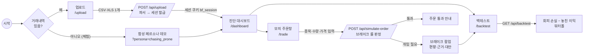
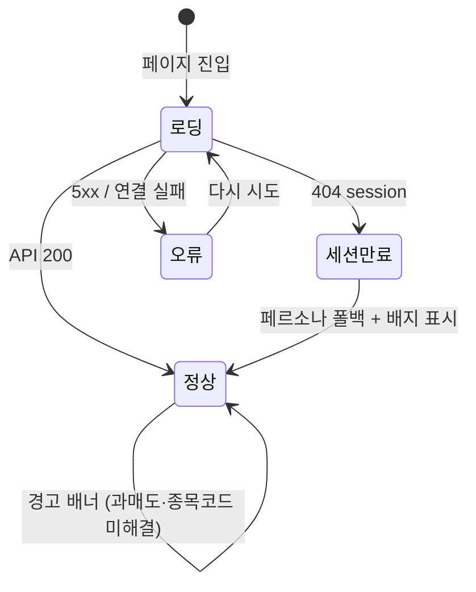
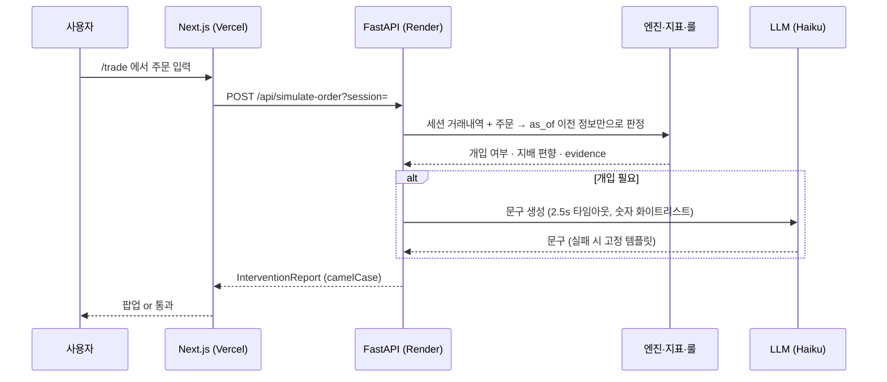

# 사용자 흐름도

> `docs/spec.md` §2 에서 참조. 화면 4개 + API 5개. 실선 = 사용자 행동, 점선 = 시스템 동작.

## 1. 전체 흐름 (90초 데모 순서)

## 2. 화면별 상태

- **로딩**: 스켈레톤(회색 카드). 서버 콜드스타트 대비.
- **세션만료**: 서버 재시작·50세션 초과로 세션이 사라지면 페르소나 데모로 폴백하고 배지로 알림.
- **오류**: `error.tsx` 안내 + 다시 시도 버튼.
- **합성 각주**: 출처가 페르소나일 때만 하단에 "실사용자 분포 아님" 표시.

## 3. 데이터 흐름 (요청 1건 기준)

원칙: 판정에 미래 가격 없음(AGENTS.md 규칙 1). 백테스트만 사후 가격으로 **평가**한다.
